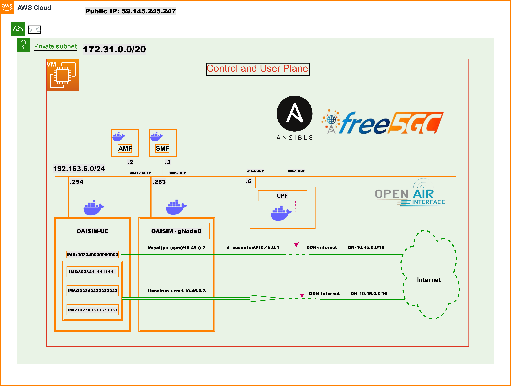
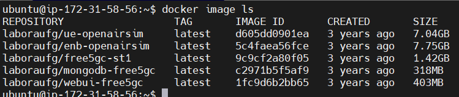
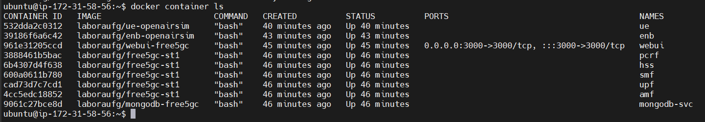
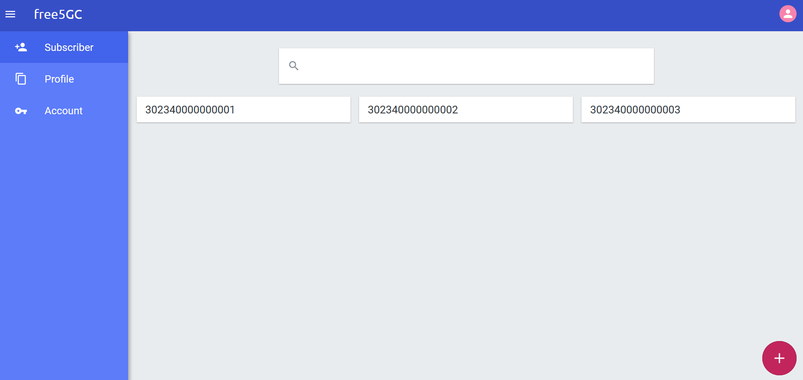
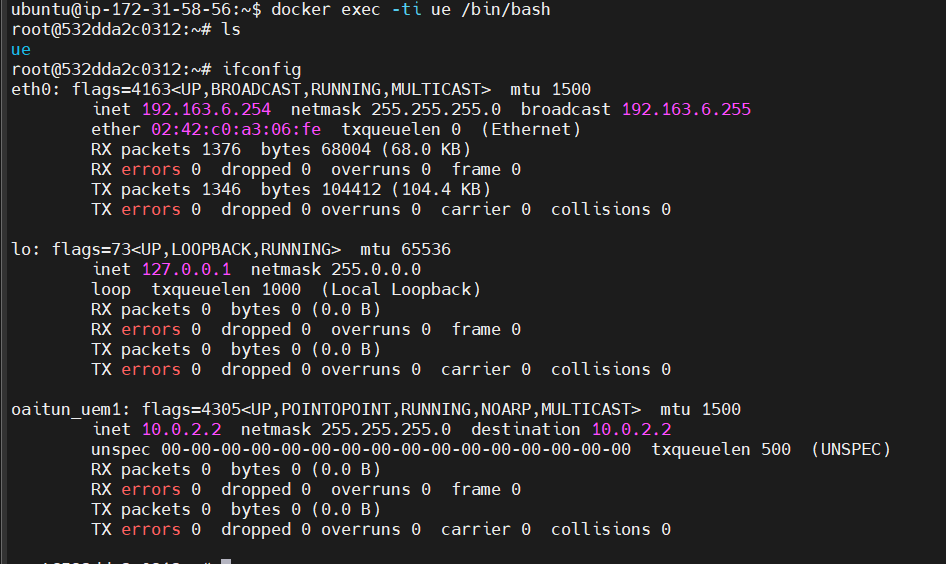
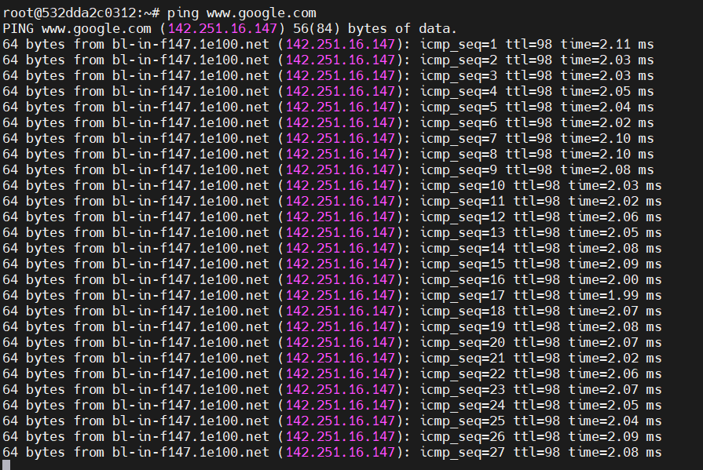

# Instructions to deploy Free5GC using docker
- [Requirements](#requirements)
    - [Systems Requirements](#system-requirements)
    - [Configurations Steps](#configuration-steps)
- [References](#references)


## Requirements
The installation can be done directly over the host operating system (OS) or inside a virtual machine (VM).

#### System requirements

- CPU type: x86-64 (specific model and number of cores only affect performance)
- RAM: 4 GB, 2vCPU
- Disk space: 40 GB
- Ubuntu 22.04 LTS

#### Configuration steps
The following steps are required to complete setup.

1. Install python 3.8 (or latest)
```
sudo apt update && apt -y install python3.8
```
2. Install git
```
sudo apt -y install git
```
3. Install ansible
```
sudo apt -y install ansible
```
4. Clone this repository
```
git clone git@github.com:jmgitcloudua/deploy-5g-opensource.git
cd deploy-5g-container/free5gc
```
5. Run ansible-playbook to deploy Free5GC network
```
ansible-playbook -K 5g-docker-deploy.yaml  -e  "internet_network_interface=<< internet network interface name>>"
```
**Note:** the password is your user root of your operating system.  If an error occured during installation, please open 5g-docker-deploy.yaml and comment docker installation section. Next, install  manually.

6. Chek the installation
```
sudo docker ps 
``` 
or formaly
```
sudo docker container ls 
``` 



7. Test the Webui interface
 - URL: http://[your ip address]:3000
 - Username: admin
 - Password: 1423
 

 
 8. Test UE acess
 ```
 sudo docker exec -ti ue bash
 ```
 To check UE ip address inside the container
 ```
 ifconfig
 ```
 
 
 ```
 ping www.google.com
 ```


**OBs:** this instructions was deployed using AWS EC2. So, you can deploy localy or whatever you want.

## References
[Free5GC Documentation](https://free5gc.org/) <br>
[Docker Documentation](https://docs.docker.com/engine/install/ubuntu/) <br>
[Ansible documentation](https://docs.ansible.com/ansible/latest/installation_guide/intro_installation.html#installing-and-upgrading-ansible) <br>
[Docker Free5GC Related Installation](https://github.com/Edwin-programmer/Project5G-ansible-deployment/tree/main/Docker%20deployment)