# Instructions to deploy OpenAirInterface using Docker-Compose and K8S

- [Requirements](#requirements)
- [5G Core Network Deployment using using Docker-Compose, perform a basic deployment](#5g-core-network-deployment-using-using-docker-compose-perform-a-basic-deployment)
    - [Undeploy/stop the deployment](#undeploystop-the-deployment)
- [OpenAirInterface 5G Core and RAN Network Function Deployment using Helm Charts](#openairinterface-5g-core-and-ran-network-function-deployment-using-helm-charts)
    - [Clean OAI using k8s](#clean-oai-deployments-using-k8s)
- [References](#references)


## Requirements
- Install [docker and docker-compose](https://docs.docker.com/engine/install/ubuntu/) (Ubuntu/Debian)
- Recommmeded to use:
    - 4 CPU
    - 16GiB RAM
    - Minimum 1.5 GiB of free storage for docker images
    - Install wireshark
## 5G Core Network Deployment using Docker-Compose, perform a basic deployment
1. First of all, we go _Pulling the images from Docker Hub_. You can create a bash script to deploy it quickly instead of typing the commands one-by-one.
```
#!/bin/bash
docker pull oaisoftwarealliance/oai-amf:v1.5.1
docker pull oaisoftwarealliance/oai-nrf:v1.5.1
docker pull oaisoftwarealliance/oai-spgwu-tiny:v1.5.1
docker pull oaisoftwarealliance/oai-smf:v1.5.1
docker pull oaisoftwarealliance/oai-udr:v1.5.1
docker pull oaisoftwarealliance/oai-udm:v1.5.1
docker pull oaisoftwarealliance/oai-ausf:v1.5.1
docker pull oaisoftwarealliance/oai-upf-vpp:v1.5.1
docker pull oaisoftwarealliance/oai-nssf:v1.5.1
docker pull oaisoftwarealliance/oai-pcf:v1.5.1
docker pull oaisoftwarealliance/oai-nef:v1.5.1
# Utility image to generate traffic
docker pull oaisoftwarealliance/trf-gen-cn5g:latest
```
- Getting a UERANSIM docker image
```
docker pull rohankharade/ueransim
docker image tag rohankharade/ueransim:latest ueransim:latest
```
**OBS.**: If you want to build the images in yourself, please, click [here](https://gitlab.eurecom.fr/oai/cn5g/oai-cn5g-fed/-/blob/master/docs/BUILD_IMAGES.md)

```
docker image ls
```


- To deploy the OAI 5G Core Network, execute the following commands:
```
cd oai-cn5g-fed/docker-compose
python3 ./core-network.py --type start-basic-vpp --scenario 1
```
OBS.: You can use _oai-cn5g-fed/docker-compose$ $ python3 ./core-network.py --help_ in order to check other optios of deployments. <br>
```
docker ps
```


2. Networking considerations <br>
This is the most important step towards end-to-end connectivity.
```
sudo sysctl net.ipv4.conf.all.forwarding=1
sudo iptables -P FORWARD ACCEPT
```
You can also edit _sudo nano /etc/sysctl.com_  and uncomment the line _net.ipv4.conf.all.forwarding=1_ <br>

3. Clone the OAI CN 5G Repository
```
git clone --branch v1.5.1 https://gitlab.eurecom.fr/oai/cn5g/oai-cn5g-fed.git
cd oai-cn5g-fed
If you forgot to clone directly to the v1.5.1 release tag
git checkout -f v1.5.1
```
- Synchronize all git submodules
```
./scripts/syncComponents.sh
---------------------------------------------------------
OAI-NRF     component branch : master
OAI-AMF     component branch : master
OAI-SMF     component branch : master
OAI-SPGW-U  component branch : master
OAI-AUSF    component branch : master
OAI-UDM     component branch : master
OAI-UDR     component branch : master
OAI-UPF-VPP component branch : master
OAI-NSSF    component branch : master
OAI-NEF     component branch : master
OAI-PCF     component branch : master
---------------------------------------------------------
```
```
git submodule deinit --all --force
git submodule init
git submodule update --init --recursive
```
4. Now we are going to deploy OAI Basic 5G core and UERANSIM
- OAI Basic 5G core
```
cd oai-cn5g-fed/docker-compose
```
```
python3 core-network.py --help
```
```
usage: core-network.py [-h] --type {start-mini,start-basic,start-basic-vpp,stop-mini,stop-basic,stop-basic-vpp} [--scenario {1,2}] [--capture CAPTURE]

OAI 5G CORE NETWORK DEPLOY

optional arguments:
  -h, --help            show this help message and exit
  --type {start-mini,start-basic,start-basic-vpp,stop-mini,stop-basic,stop-basic-vpp}, -t {start-mini,start-basic,start-basic-vpp,stop-mini,stop-basic,stop-basic-vpp}
                        Functional type of 5g core network ("start-mini"|"start-basic"|"start-basic-vpp"|"stop-mini"|"stop-basic"|"stop-basic-vpp")
  --scenario {1,2}, -s {1,2}
                        Scenario with NRF ("1") and without NRF ("2")
  --capture CAPTURE, -c CAPTURE
                        Add an automatic PCAP capture on docker networks to CAPTURE file

example:
        python3 core-network.py --type start-mini
        python3 core-network.py --type start-basic
        python3 core-network.py --type start-basic-vpp
        python3 core-network.py --type stop-mini
        python3 core-network.py --type start-mini --scenario 2
        python3 core-network.py --type start-basic --scenario 2

```
```
python3 core-network.py --type start-basic --scenario 1
```
- Executing UERANSIM
```
cd cd oai-cn5g-fed/docker-compose
```
```
docker-compose -f docker-compose-ueransim-vpp.yaml up -d
```
5. We'll show several images about logs  with diffents functions

- SMF Log <br>
```
[2023-11-26 12:00:36.044] [smf_app] [start] Options parsed
[2023-11-26 12:00:36.046] [smf_app] [info] SettingNotFoundException : SMF.ITTI_TASKS, using defaults
[2023-11-26 12:00:36.047] [smf_app] [info] SettingNotFoundException : SMF.INTERFACES.N4.SCHED_PARAMS, using defaults
[2023-11-26 12:00:36.047] [smf_app] [info] SettingNotFoundException : SMF.INTERFACES.SBI.SCHED_PARAMS, using defaults
[2023-11-26 12:00:36.047] [smf_app] [warning] Local PCC rules feature is not yet supported, the default values from the config file are used.
[2023-11-26 12:00:36.101] [smf_app] [debug] Resolved a DNS (name oai-amf, protocol http): Ip Addr 192.168.70.132, port 80
[2023-11-26 12:00:36.102] [smf_app] [debug] Resolved a DNS (name oai-nrf, protocol http): Ip Addr 192.168.70.130, port 80
[2023-11-26 12:00:36.102] [smf_app] [info] ==== OAI-CN5G SMF vBranch: HEAD Abrev. Hash: 090579d4 Date: Mon May 15 10:52:37 2023 +0200 ====
[2023-11-26 12:00:36.103] [smf_app] [info] Configuration SMF:
[2023-11-26 12:00:36.103] [smf_app] [info] - Instance ..............: 0

[2023-11-26 12:00:36.103] [smf_app] [info] - PID dir ...............: /var/run

[2023-11-26 12:00:36.103] [smf_app] [info] - N4 Networking:
[2023-11-26 12:00:36.103] [smf_app] [info]     Interface name ......: eth0
[2023-11-26 12:00:36.103] [smf_app] [info]     IPv4 Addr ...........: 192.168.70.133
[2023-11-26 12:00:36.103] [smf_app] [info]     Port ................: 8805
[2023-11-26 12:00:36.104] [smf_app] [info] - SBI Networking:
[2023-11-26 12:00:36.104] [smf_app] [info]     Interface name ......: eth0
[2023-11-26 12:00:36.104] [smf_app] [info]     IPv4 Addr ...........: 192.168.70.133
[2023-11-26 12:00:36.104] [smf_app] [info]     Port ................: 80
[2023-11-26 12:00:36.104] [smf_app] [info]     HTTP2 port ..........: 8080
[2023-11-26 12:00:36.104] [smf_app] [info]     API version..........: v1
[2023-11-26 12:00:36.104] [smf_app] [info] - AMF:
[2023-11-26 12:00:36.105] [smf_app] [info]     IPv4 Addr ...........: 192.168.70.132
[2023-11-26 12:00:36.105] [smf_app] [info]     Port ................: 8080  
[2023-11-26 12:00:36.105] [smf_app] [info]     API version .........: v1
[2023-11-26 12:00:36.105] [smf_app] [info]     FQDN ................: oai-amf
[2023-11-26 12:00:36.105] [smf_app] [info] - NRF:
[2023-11-26 12:00:36.105] [smf_app] [info]     IPv4 Addr ...........: 192.168.70.130
[2023-11-26 12:00:36.105] [smf_app] [info]     Port ................: 8080  
[2023-11-26 12:00:36.105] [smf_app] [info]     API version .........: v1
[2023-11-26 12:00:36.105] [smf_app] [info]     FQDN ................: oai-nrf
[2023-11-26 12:00:36.106] [smf_app] [info] - DEFAULT DNS:
[2023-11-26 12:00:36.106] [smf_app] [info]     Primary DNS .........: 172.21.3.100
[2023-11-26 12:00:36.106] [smf_app] [info]     Secondary DNS .......: 8.8.8.8
[2023-11-26 12:00:36.106] [smf_app] [info]     Primary DNS v6 ......: 2001:4860:4860::8888
[2023-11-26 12:00:36.106] [smf_app] [info]     Secondary DNS v6 ....: 2001:4860:4860::8844
[2023-11-26 12:00:36.106] [smf_app] [info] - CSCF:
[2023-11-26 12:00:36.106] [smf_app] [info]     CSCF IPv4 ...........: 127.0.0.1
[2023-11-26 12:00:36.106] [smf_app] [info]     CSCF IPv6 ...........: fe80::7915:f408:1787:db8b
[2023-11-26 12:00:36.106] [smf_app] [info] - Default UE MTU: 1500
[2023-11-26 12:00:36.106] [smf_app] [info] - Supported Features:
[2023-11-26 12:00:36.106] [smf_app] [info]     Register to NRF.....................: Yes
[2023-11-26 12:00:36.106] [smf_app] [info]     Discover UPF........................: Yes
[2023-11-26 12:00:36.106] [smf_app] [info]     Discover PCF........................: No
[2023-11-26 12:00:36.106] [smf_app] [info]     Use Local Subscription Configuration: Yes
[2023-11-26 12:00:36.107] [smf_app] [info]     Use Local PCC Rules: ...............: Yes
[2023-11-26 12:00:36.107] [smf_app] [info]     Push PCO (DNS+MTU)..................: No
[2023-11-26 12:00:36.107] [smf_app] [info]     Use FQDN ...........................: Yes
[2023-11-26 12:00:36.107] [smf_app] [info]     ENABLE USAGE REPORTING..............: Yes
[2023-11-26 12:00:36.107] [smf_app] [info]     ENABLE DL PDR IN PFCP SESSION ESTAB.: No
[2023-11-26 12:00:36.107] [smf_app] [info]     UPF N3 LOCAL ADDRESS ...............: 0.0.0.0
[2023-11-26 12:00:36.107] [smf_app] [info] - DNN configurations:
[2023-11-26 12:00:36.107] [smf_app] [info]     DNN..........: default (IPV4)
[2023-11-26 12:00:36.107] [smf_app] [info]         IPv4 pool: 12.1.1.2 - 12.1.1.50
[2023-11-26 12:00:36.107] [smf_app] [info]     DNN..........: ims (IPV4V6)
[2023-11-26 12:00:36.107] [smf_app] [info]         IPv4 pool: 14.1.1.2 - 14.1.1.253
[2023-11-26 12:00:36.107] [smf_app] [info]         IPv6 pool: 2001:1:2::/64
[2023-11-26 12:00:36.107] [smf_app] [info]     DNN..........: oai (IPV4)
[2023-11-26 12:00:36.107] [smf_app] [info]         IPv4 pool: 12.1.1.151 - 12.1.1.253
[2023-11-26 12:00:36.108] [smf_app] [info]     DNN..........: oai.ipv4 (IPV4)
[2023-11-26 12:00:36.108] [smf_app] [info]         IPv4 pool: 12.1.1.51 - 12.1.1.150
[2023-11-26 12:00:36.108] [smf_app] [info] - Local Subscription Configuration:
[2023-11-26 12:00:36.108] [smf_app] [info]     Session Management Subscription Data 0:
[2023-11-26 12:00:36.108] [smf_app] [info]         SST: 1
[2023-11-26 12:00:36.108] [smf_app] [info]         DNN: oai
[2023-11-26 12:00:36.108] [smf_app] [info]         DEFAULT_SESSION_TYPE: IPv4
[2023-11-26 12:00:36.108] [smf_app] [info]         DEFAULT_SSC_MODE: 1
[2023-11-26 12:00:36.108] [smf_app] [info]         QOS_PROFILE_5QI: 6
[2023-11-26 12:00:36.108] [smf_app] [info]         QOS_PROFILE_PRIORITY_LEVEL: 1
[2023-11-26 12:00:36.108] [smf_app] [info]         QOS_PROFILE_ARP_PRIORITY_LEVEL: 1
[2023-11-26 12:00:36.108] [smf_app] [info]         QOS_PROFILE_ARP_PREEMPTCAP: NOT_PREEMPT
[2023-11-26 12:00:36.109] [smf_app] [info]         QOS_PROFILE_ARP_PREEMPTVULN: NOT_PREEMPTABLE
[2023-11-26 12:00:36.109] [smf_app] [info]         SESSION_AMBR_UL: 200Mbps
[2023-11-26 12:00:36.109] [smf_app] [info]         SESSION_AMBR_DL: 400Mbps
[2023-11-26 12:00:36.109] [smf_app] [info]     Session Management Subscription Data 1:
[2023-11-26 12:00:36.109] [smf_app] [info]         SST, SD: 1, 1 (0x1)
[2023-11-26 12:00:36.109] [smf_app] [info]         DNN: oai.ipv4
[2023-11-26 12:00:36.109] [smf_app] [info]         DEFAULT_SESSION_TYPE: IPv4
[2023-11-26 12:00:36.109] [smf_app] [info]         DEFAULT_SSC_MODE: 1
[2023-11-26 12:00:36.109] [smf_app] [info]         QOS_PROFILE_5QI: 7
[2023-11-26 12:00:36.109] [smf_app] [info]         QOS_PROFILE_PRIORITY_LEVEL: 1
[2023-11-26 12:00:36.109] [smf_app] [info]         QOS_PROFILE_ARP_PRIORITY_LEVEL: 1
[2023-11-26 12:00:36.109] [smf_app] [info]         QOS_PROFILE_ARP_PREEMPTCAP: NOT_PREEMPT
[2023-11-26 12:00:36.109] [smf_app] [info]         QOS_PROFILE_ARP_PREEMPTVULN: NOT_PREEMPTABLE
[2023-11-26 12:00:36.110] [smf_app] [info]         SESSION_AMBR_UL: 100Mbps
[2023-11-26 12:00:36.110] [smf_app] [info]         SESSION_AMBR_DL: 200Mbps
[2023-11-26 12:00:36.110] [smf_app] [info]     Session Management Subscription Data 2:
[2023-11-26 12:00:36.110] [smf_app] [info]         SST, SD: 222, 123 (0x7b)
[2023-11-26 12:00:36.110] [smf_app] [info]         DNN: default
[2023-11-26 12:00:36.110] [smf_app] [info]         DEFAULT_SESSION_TYPE: IPv4
[2023-11-26 12:00:36.110] [smf_app] [info]         DEFAULT_SSC_MODE: 1
[2023-11-26 12:00:36.110] [smf_app] [info]         QOS_PROFILE_5QI: 8
[2023-11-26 12:00:36.110] [smf_app] [info]         QOS_PROFILE_PRIORITY_LEVEL: 1
[2023-11-26 12:00:36.111] [smf_app] [info]         QOS_PROFILE_ARP_PRIORITY_LEVEL: 1
[2023-11-26 12:00:36.111] [smf_app] [info]         QOS_PROFILE_ARP_PREEMPTCAP: NOT_PREEMPT
[2023-11-26 12:00:36.111] [smf_app] [info]         QOS_PROFILE_ARP_PREEMPTVULN: NOT_PREEMPTABLE
[2023-11-26 12:00:36.111] [smf_app] [info]         SESSION_AMBR_UL: 50Mbps
[2023-11-26 12:00:36.111] [smf_app] [info]         SESSION_AMBR_DL: 100Mbps
[2023-11-26 12:00:36.111] [smf_app] [info] - Log Level will be .......: debug
[2023-11-26 12:00:36.111] [itti   ] [start] Starting...
[2023-11-26 12:00:36.111] [itti   ] [start] Started
[2023-11-26 12:00:36.112] [async  ] [start] Starting...
[2023-11-26 12:00:36.112] [itti   ] [info] Starting timer_manager_task
[2023-11-26 12:00:36.112] [itti   ] [warning] Could not set schedparam to ITTI task 0, err=1
[2023-11-26 12:00:36.112] [async  ] [warning] Could not set schedparam to ITTI task 1, err=1
[2023-11-26 12:00:36.113] [async  ] [start] Started
[2023-11-26 12:00:36.113] [smf_app] [start] Starting...
[2023-11-26 12:00:36.113] [smf_app] [info] Apply config...
[2023-11-26 12:00:36.114] [smf_app] [info] Applied config default
[2023-11-26 12:00:36.114] [smf_app] [info] PAA Ipv4: 12.1.1.2
[2023-11-26 12:00:36.114] [smf_app] [info] Applied config ims
[2023-11-26 12:00:36.114] [smf_app] [info] PAA Ipv4: 14.1.1.2
[2023-11-26 12:00:36.114] [smf_app] [info] Applied config for IPv6 ims
[2023-11-26 12:00:36.114] [smf_app] [info] Applied config oai
[2023-11-26 12:00:36.115] [smf_app] [info] PAA Ipv4: 12.1.1.151
[2023-11-26 12:00:36.115] [smf_app] [info] Applied config oai.ipv4
[2023-11-26 12:00:36.115] [smf_app] [info] PAA Ipv4: 12.1.1.51
[2023-11-26 12:00:36.115] [smf_app] [info] Applied config
[2023-11-26 12:00:36.117] [udp    ] [debug] Creating new listen socket on address 192.168.70.133 and port 8805 
[2023-11-26 12:00:36.117] [udp    ] [debug] udp_server::udp_server(192.168.70.133:8805)
[2023-11-26 12:00:36.117] [udp    ] [debug] Creating new listen socket on address 192.168.70.133 and port 0 
[2023-11-26 12:00:36.117] [udp    ] [debug] udp_server::udp_server(192.168.70.133:0)
[2023-11-26 12:00:36.117] [pfcp   ] [info] pfcp_l4_stack created listening to 192.168.70.133:8805
[2023-11-26 12:00:36.118] [smf_n4 ] [start] Starting...
[2023-11-26 12:00:36.118] [udp    ] [warning] Could not set schedparam to ITTI task 6, err=1
[2023-11-26 12:00:36.118] [udp    ] [warning] Could not set schedparam to ITTI task 6, err=1
[2023-11-26 12:00:36.119] [smf_n4 ] [start] Started
[2023-11-26 12:00:36.119] [smf_sbi] [start] Starting...
[2023-11-26 12:00:36.121] [smf_sbi] [start] Started
[2023-11-26 12:00:36.121] [smf_app] [start] Started
[2023-11-26 12:00:36.123] [smf_app] [debug] Send ITTI msg to N11 task to subscribe to UPF status notification from NRF
[2023-11-26 12:00:36.123] [smf_api] [info] HTTP2 server started
[2023-11-26 12:00:36.123] [smf_api] [info] HTTP1 server started
[2023-11-26 12:00:36.123] [smf_sbi] [debug] Send NFSubscribeNotify to NRF to be notified when a new UPF becomes available (HTTP version 2)
[2023-11-26 12:00:36.124] [smf_sbi] [debug] NRF's URL: 192.168.70.130:8080/nnrf-nfm/v1/subscriptions
[2023-11-26 12:00:36.124] [smf_sbi] [debug] Message body: {"nfStatusNotificationUri":"192.168.70.133:8080/nsmf-nfstatus-notify/v1/subscriptions","reqNotifEvents":["NF_REGISTERED","NF_DEREGISTERED"],"subscrCond":{"NfTypeCond":{"nfType":"UPF"}},"validityTime":"20390531T235959"}
[2023-11-26 12:00:36.124] [smf_sbi] [debug] Promise ID generated 1
[2023-11-26 12:00:36.129] [smf_api] [info] NFStatusNotifyApiImpl, received a NF status notification...
[2023-11-26 12:00:36.129] [smf_app] [debug] Convert NotificationData (OpenAPI) to Data Notification Msg
[2023-11-26 12:00:36.129] [smf_app] [debug] NF instance info
[2023-11-26 12:00:36.129] [smf_app] [debug] 	Instance ID: 241554ab-6016-4d2a-a6cd-3fd5fb712bb4
[2023-11-26 12:00:36.129] [smf_app] [debug] 	Instance name: VPP-UPF
[2023-11-26 12:00:36.129] [smf_app] [debug] 	Instance type: UPF
[2023-11-26 12:00:36.129] [smf_app] [debug] 	Status: REGISTERED
[2023-11-26 12:00:36.129] [smf_app] [debug] 	HeartBeat timer: 10
[2023-11-26 12:00:36.129] [smf_app] [debug] 	Priority: 1
[2023-11-26 12:00:36.129] [smf_app] [debug] 	Capacity: 100
[2023-11-26 12:00:36.129] [smf_app] [debug] 	SNSSAI:
[2023-11-26 12:00:36.129] [smf_app] [debug] 		 SST 222, SD 123 (0x7b)
[2023-11-26 12:00:36.129] [smf_app] [debug] 	FQDN: vpp-upf.node.5gcn.mnc95.mcc208.3gppnetwork.org
[2023-11-26 12:00:36.129] [smf_app] [debug] 	IPv4 Addr:
[2023-11-26 12:00:36.129] [smf_app] [debug] 		 192.168.70.201
[2023-11-26 12:00:36.129] [smf_app] [debug] 	UPF Info:
[2023-11-26 12:00:36.129] [smf_app] [debug] 		Parameters supported by the UPF:
[2023-11-26 12:00:36.129] [smf_app] [debug] 			SNSSAI (SST 222, SD 123 (0x7b))
[2023-11-26 12:00:36.129] [smf_app] [debug] 			DNN default
[2023-11-26 12:00:36.129] [smf_app] [debug] 		INTERFACE UPF Info List, Interface Type : N6, Network Instance internet.oai.org, EndpointFqdn: internet.oai.org
[2023-11-26 12:00:36.129] [smf_app] [debug] 			INTERFACE UPF Info List, IPv4 Addr:
[2023-11-26 12:00:36.129] [smf_app] [debug] 						 192.168.73.201
[2023-11-26 12:00:36.129] [smf_app] [debug] 		INTERFACE UPF Info List, Interface Type : N3, Network Instance access.oai.org, EndpointFqdn: access.oai.org
[2023-11-26 12:00:36.129] [smf_app] [debug] 			INTERFACE UPF Info List, IPv4 Addr:
[2023-11-26 12:00:36.129] [smf_app] [debug] 						 192.168.72.201
[2023-11-26 12:00:36.129] [smf_app] [info] Handle a NF status notification from NRF (HTTP version 2)
[2023-11-26 12:00:36.130] [smf_app] [debug] Resolved a DNS (name vpp-upf.node.5gcn.mnc95.mcc208.3gppnetwork.org, protocol http): Ip Addr 192.168.70.201, port 80
[2023-11-26 12:00:36.130] [smf_app] [debug] Add a new UPF node with FQDN: vpp-upf.node.5gcn.mnc95.mcc208.3gppnetwork.org
[2023-11-26 12:00:36.130] [smf_app] [debug] Add a new UPF node with Ipv4 Addr: 192.168.70.201
[2023-11-26 12:00:36.130] [smf_app] [debug] Start a PFCP Association procedure with an UPF
[2023-11-26 12:00:36.130] [smf_app] [debug] Resolving an FQDN/IP Addr for an UPF node
[2023-11-26 12:00:36.132] [smf_app] [debug] Got response with HTTP code  201!
[2023-11-26 12:00:36.132] [smf_app] [debug] Prepare to make promise id 1 ready!
[2023-11-26 12:00:36.132] [smf_app] [debug] Trigger process response: Set promise with ID 1 to ready
[2023-11-26 12:00:36.132] [smf_sbi] [debug] Got result for promise ID 1
[2023-11-26 12:00:36.132] [smf_sbi] [debug] Response data {"nfStatusNotificationUri":"192.168.70.133:8080/nsmf-nfstatus-notify/v1/subscriptions","reqNotifEvents":["NF_REGISTERED","NF_DEREGISTERED"],"subscrCond":{"NfTypeCond":{"nfType":"UPF"}},"subscriptionId":"1","validityTime":"20390531T235959"}
[2023-11-26 12:00:36.132] [smf_sbi] [debug] NF Instance Registration, response from NRF, HTTP Code: 201
[2023-11-26 12:00:36.132] [smf_sbi] [debug] NFSubscribeNotify, got successful response from NRF
[2023-11-26 12:00:36.133] [smf_app] [debug] Register SMF with NRF
[2023-11-26 12:00:36.134] [smf_app] [debug] NF instance info
[2023-11-26 12:00:36.134] [smf_app] [debug] 	Instance ID: 2bb48962-19ea-456f-b37f-be9ed2cb03af
[2023-11-26 12:00:36.134] [smf_app] [debug] 	Instance name: OAI-SMF
[2023-11-26 12:00:36.134] [smf_app] [debug] 	Instance type: SMF
[2023-11-26 12:00:36.134] [smf_app] [debug] 	Status: REGISTERED
[2023-11-26 12:00:36.135] [smf_app] [debug] 	HeartBeat timer: 50
[2023-11-26 12:00:36.135] [smf_app] [debug] 	Priority: 1
[2023-11-26 12:00:36.135] [smf_app] [debug] 	Capacity: 100
[2023-11-26 12:00:36.135] [smf_app] [debug] 	SNSSAI:
[2023-11-26 12:00:36.135] [smf_app] [debug] 		 SST 1, SD 16777215 (0xffffff)
[2023-11-26 12:00:36.136] [smf_app] [debug] 		 SST 1, SD 1 (0x1)
[2023-11-26 12:00:36.136] [smf_app] [debug] 		 SST 222, SD 123 (0x7b)
[2023-11-26 12:00:36.136] [smf_app] [debug] 	IPv4 Addr:
[2023-11-26 12:00:36.136] [smf_app] [debug] 		 192.168.70.133
[2023-11-26 12:00:36.136] [smf_app] [debug] 	NF Service
[2023-11-26 12:00:36.137] [smf_app] [debug] 		Service Instance ID: nsmf-pdusession, Service name: nsmf-pdusession, Version (apiVersionInUri: v1, apiFullVersion: 1.0.0 ), Scheme: http, Service status: REGISTERED,  IpEndPoints: Ipv4 Address: 192.168.70.133, TransportProtocol: TCP, Port: 8080
[2023-11-26 12:00:36.137] [smf_app] [debug] 	SMF Info:
[2023-11-26 12:00:36.137] [smf_app] [debug] 		Parameters supported by the SMF:
[2023-11-26 12:00:36.137] [smf_app] [debug] 			SNSSAI (SST 1, SD 16777215 (0xffffff))
[2023-11-26 12:00:36.137] [smf_app] [debug] 			DNN oai
[2023-11-26 12:00:36.138] [smf_app] [debug] 		Parameters supported by the SMF:
[2023-11-26 12:00:36.138] [smf_app] [debug] 			SNSSAI (SST 1, SD 1 (0x1))
[2023-11-26 12:00:36.138] [smf_app] [debug] 			DNN oai.ipv4
[2023-11-26 12:00:36.138] [smf_app] [debug] 		Parameters supported by the SMF:
[2023-11-26 12:00:36.138] [smf_app] [debug] 			SNSSAI (SST 222, SD 123 (0x7b))
[2023-11-26 12:00:36.138] [smf_app] [debug] 			DNN default
[2023-11-26 12:00:36.139] [smf_app] [debug] Send ITTI msg to N11 task to trigger the registration request to NRF
[2023-11-26 12:00:36.139] [smf_sbi] [debug] Send NF Instance Registration to NRF (HTTP version 2)
```
- AMF Log
```
[2023-11-26 12:00:56.077] [ngap] [debug] Received TAC 0xa000
[2023-11-26 12:00:56.079] [amf_n2] [info] Received UPLINK_NAS_TRANSPORT message, handling
[2023-11-26 12:00:56.080] [amf_n2] [debug] Handle Uplink NAS Transport...
[2023-11-26 12:00:56.080] [ngap] [debug] Free NGAP Message PDU
[2023-11-26 12:00:56.088] [amf_app] [info] 
[2023-11-26 12:00:56.088] [amf_app] [info] |----------------------------------------------------------------------------------------------------------------|
[2023-11-26 12:00:56.088] [amf_app] [info] |----------------------------------------------------gNBs' information-------------------------------------------|
[2023-11-26 12:00:56.088] [amf_app] [info] |    Index    |      Status      |       Global ID       |       gNB Name       |               PLMN             |
[2023-11-26 12:00:56.088] [amf_app] [info] |      1      |    Connected     |         0x1         |         UERANSIM-gnb-208-95-1             |            208, 95             | 
[2023-11-26 12:00:56.088] [amf_app] [info] |----------------------------------------------------------------------------------------------------------------|
[2023-11-26 12:00:56.088] [amf_app] [info] 
[2023-11-26 12:00:56.088] [amf_app] [info] |----------------------------------------------------------------------------------------------------------------|
[2023-11-26 12:00:56.088] [amf_app] [info] |----------------------------------------------------UEs' information--------------------------------------------|
[2023-11-26 12:00:56.088] [amf_app] [info] | Index |      5GMM state      |      IMSI        |     GUTI      | RAN UE NGAP ID | AMF UE ID |  PLMN   |Cell ID|
[2023-11-26 12:00:56.088] [amf_app] [info] |      1|    5GMM-REG-INITIATED|   208950000000031|               |               1|          1| 208, 95 |    256|
[2023-11-26 12:00:56.088] [amf_app] [info] |      2|    5GMM-REG-INITIATED|   208950000000034|               |               4|          4| 208, 95 |    256|
[2023-11-26 12:00:56.088] [amf_app] [info] |      3|    5GMM-REG-INITIATED|   208950000000035|               |               3|          3| 208, 95 |    256|
[2023-11-26 12:00:56.088] [amf_app] [info] |      4|    5GMM-REG-INITIATED|   208950000000039|               |               2|          2| 208, 95 |    256|
[2023-11-26 12:00:56.088] [amf_app] [info] |----------------------------------------------------------------------------------------------------------------|
[2023-11-26 12:00:56.088] [amf_app] [info] 
[2023-11-26 12:00:56.105] [amf_sbi] [info] Get response with HTTP code (201)
[2023-11-26 12:00:56.105] [amf_sbi] [info] Get response with Json content: {"5gAuthData":{"autn":"ee1dd03d540380007ee83ccd582e130f","hxresStar":"fe1fe7acedc89d5cb8a2daf6696ef05f","rand":"80106f68eada0f007ec9f803bd3fab31"},"_links":{"5G_AKA":{"href":"http://192.168.70.138:8080/nausf-auth/v1/ue-authentications/ee1dd03d540380007ee83ccd582e130f/5g-aka-confirmation"}},"authType":"5G_AKA"}
[2023-11-26 12:00:56.105] [amf_sbi] [debug] UE Authentication, response from AUSF, HTTP Code: 201
[2023-11-26 12:00:56.105] [amf_sbi] [debug] UE Authentication, response from AUSF
, {"5gAuthData":{"autn":"ee1dd03d540380007ee83ccd582e130f","hxresStar":"fe1fe7acedc89d5cb8a2daf6696ef05f","rand":"80106f68eada0f007ec9f803bd3fab31"},"_links":{"5G_AKA":{"href":"http://192.168.70.138:8080/nausf-auth/v1/ue-authentications/ee1dd03d540380007ee83ccd582e130f/5g-aka-confirmation"}},"authType":"5G_AKA"} 
[2023-11-26 12:00:56.105] [amf_app] [warning] Format error in format string Data %s (%d bytes): invalid type specifier
[2023-11-26 12:00:56.105] [amf_app] [debug] Data (formatted):
80 10 6f 68 ea da f 0 7e c9 f8 3 bd 3f ab 31 
[2023-11-26 12:00:56.105] [amf_n1] [debug] 5G AV: RAND
80 10 6f 68 ea da 0f 00 7e c9 f8 03 bd 3f ab 31 
[2023-11-26 12:00:56.106] [amf_app] [warning] Format error in format string Data %s (%d bytes): invalid type specifier
[2023-11-26 12:00:56.106] [amf_app] [debug] Data (formatted):
ee 1d d0 3d 54 3 80 0 7e e8 3c cd 58 2e 13 f 
[2023-11-26 12:00:56.106] [amf_n1] [debug] 5G AV: AUTN
ee 1d d0 3d 54 03 80 00 7e e8 3c cd 58 2e 13 0f 
[2023-11-26 12:00:56.106] [amf_app] [warning] Format error in format string Data %s (%d bytes): invalid type specifier
[2023-11-26 12:00:56.106] [amf_app] [debug] Data (formatted):
fe 1f e7 ac ed c8 9d 5c b8 a2 da f6 69 6e f0 5f 
[2023-11-26 12:00:56.106] [amf_n1] [debug] 5G AV: hxres*
fe 1f e7 ac ed c8 9d 5c b8 a2 da f6 69 6e f0 5f 
[2023-11-26 12:00:56.106] [amf_n1] [info] Links is: http://192.168.70.138:8080/nausf-auth/v1/ue-authentications/ee1dd03d540380007ee83ccd582e130f/5g-aka-confirmation
[2023-11-26 12:00:56.106] [amf_n1] [debug] Received Security Vectors, try to setup security with the UE
[2023-11-26 12:00:56.106] [amf_n1] [debug] Starting Authentication procedure
[2023-11-26 12:00:56.106] [amf_n1] [debug] Sending Authentication Request with RAND
[2023-11-26 12:00:56.106] [amf_n1] [debug] RAND
80 10 6f 68 ea da 0f 00 7e c9 f8 03 bd 3f ab 31 
[2023-11-26 12:00:56.106] [nas_mm] [debug] Encoding AuthenticationRequest message
[2023-11-26 12:00:56.106] [nas_mm] [debug] Encoding NasMmPlainHeader
[2023-11-26 12:00:56.106] [nas_mm] [debug] Encoded NasMmPlainHeader (len 3 octets)
[2023-11-26 12:00:56.106] [nas_mm] [debug] Encoding ABBA
[2023-11-26 12:00:56.106] [nas_mm] [debug] Encoded ABBA, len (3)
[2023-11-26 12:00:56.106] [nas_mm] [debug] Encoding Authentication Parameter RAND
[2023-11-26 12:00:56.106] [nas_mm] [debug] Encoded Authentication Parameter RAND, len (17)
[2023-11-26 12:00:56.106] [nas_mm] [debug] Encoding Authentication Parameter AUTN
[2023-11-26 12:00:56.106] [nas_mm] [debug] Encoded Authentication_Parameter_AUTN len (18)
[2023-11-26 12:00:56.106] [nas_mm] [debug] IE EAP Message is not available
[2023-11-26 12:00:56.106] [nas_mm] [debug] Encoded AuthenticationRequest message (len 42)
[2023-11-26 12:00:56.106] [amf_n1] [debug] Authentication-Request message buffer
7e 00 56 05 02 00 00 21 80 10 6f 68 ea da 0f 00 7e c9 f8 03 bd 3f ab 31 20 10 ee 1d d0 3d 54 03 80 00 7e e8 3c cd 58 2e 13 0f 
[2023-11-26 12:00:56.106] [amf_n1] [debug] amf_ue_ngap_id 4
[2023-11-26 12:00:56.106] [amf_n2] [info] Encoding DOWNLINK NAS TRANSPORT message, sending
[2023-11-26 12:00:56.106] [amf_n2] [debug] Handle DL NAS Transport ...
InitiatingMessage ::= {
    procedureCode: 4
    criticality: 1 (ignore)
    value: DownlinkNASTransport ::= {
        protocolIEs: ProtocolIE-Container ::= {
            DownlinkNASTransport-IEs ::= {
                id: 10
                criticality: 0 (reject)
                value: 4
            }
            DownlinkNASTransport-IEs ::= {
                id: 85
                criticality: 0 (reject)
                value: 4
            }
            DownlinkNASTransport-IEs ::= {
                id: 38
                criticality: 0 (reject)
                value: 
                    7E 00 56 05 02 00 00 21 80 10 6F 68 EA DA 0F 00 
                    7E C9 F8 03 BD 3F AB 31 20 10 EE 1D D0 3D 54 03 
                    80 00 7E E8 3C CD 58 2E 13 0F
            }
        }
    }
}
[2023-11-26 12:00:56.106] [ngap] [debug] Encoded size (66)
[2023-11-26 12:00:56.106] [sctp] [debug] [Socket 23, Assoc ID 18] Sending buffer 0x7f143c001e30 of 66 bytes on stream 0 with ppid 60
[2023-11-26 12:00:56.106] [sctp] [debug] Successfully sent 66 bytes on stream 0
[2023-11-26 12:00:56.106] [ngap] [debug] Free NGAP Message PDU
[2023-11-26 12:00:56.106] [amf_n1] [info] Received UL_NAS_DATA_IND
[2023-11-26 12:00:56.106] [sctp] [info] [Assoc_id 18, Socket 23] Received a msg (length 68) from port 41450, on stream 3, PPID 60
[2023-11-26 12:00:56.106] [amf_n1] [debug] Serving network name 5G:mnc095.mcc208.3gppnetwork.org
[2023-11-26 12:00:56.106] [ngap] [debug] Handling SCTP payload from SCTP Server on assoc_id (18), stream_id (3), instreams (10), outstreams (10)
[2023-11-26 12:00:56.106] [amf_n1] [warning] No existing nas_context with amf_ue_ngap_id 5
[2023-11-26 12:00:56.106] [amf_n1] [debug] Received Uplink NAS Message
7e 00 41 79 00 0d 01 02 f8 59 00 00 00 00 00 00 00 00 33 2e 04 f0 f0 f0 f0 
[2023-11-26 12:00:56.106] [amf_n1] [debug] Received plain NAS message
[2023-11-26 12:00:56.106] [amf_n1] [debug] Decoded Plain Message
7e 00 41 79 00 0d 01 02 f8 59 00 00 00 00 00 00 00 00 33 2e 04 f0 f0 f0 f0 
[2023-11-26 12:00:56.106] [amf_n1] [debug] Received NAS Signalling Establishment request...
[2023-11-26 12:00:56.106] [amf_n1] [debug] No existing nas_context with amf_ue_ngap_id 5 --> Create a new one
[2023-11-26 12:00:56.106] [ngap] [debug] Decoded NGAP message, procedure code 46, present 1
InitiatingMessage ::= {
    procedureCode: [2023-11-26 12:00:56.106] [amf_n1] [debug] NAS message type 0x41
[2023-11-26 12:00:56.106] [amf_n1] [debug] Received Registration Request message, handling...
46
    criticality: 1 (ignore)
    value: UplinkNASTransport ::= {
        protocolIEs: ProtocolIE-Container ::= {
            UplinkNASTransport-IEs ::= {
                id: 10
[2023-11-26 12:00:56.106] [nas_mm] [debug] Decoding RegistrationRequest message
    [2023-11-26 12:00:56.106] [nas_mm] [debug] Decoding NasMmPlainHeader
[2023-11-26 12:00:56.106] [nas_mm] [debug] Decoded NasMmPlainHeader len (3 octets)
[2023-11-26 12:00:56.106] [nas_mm] [debug] Decoding 5GSMobilityIdentity
[2023-11-26 12:00:56.106] [amf_n1] [debug] Decoded 5GSMobilityIdentity IE length 13
[2023-11-26 12:00:56.106] [nas_mm] [debug] Decoding 5GSMobilityIdentity SUCI
            criticality: 0 (reject)
                value: 3
            }
            UplinkNASTransport-IEs[2023-11-26 12:00:56.106] [nas_mm] [debug] MCC 208, MNC 95
 ::= {[2023-11-26 12:00:56.106] [nas_mm] [debug] MCC 208, MNC 95
[2023-11-26 12:00:56.106] [nas_mm] [debug] Decoded Routing Indicator 0000

                id: [2023-11-26 12:00:56.106] [nas_mm] [debug] Decoded MSIN 0000000033
[2023-11-26 12:00:56.106] [nas_mm] [debug] Decoded 5GSMobilityIdentity SUCI SUPI format IMSI (len 13)
85
                criticality: 0 (reject)
                [2023-11-26 12:00:56.106] [nas_mm] [debug] Decoded SUCI (15 octets)
value[2023-11-26 12:00:56.106] [nas_mm] [debug] Decoded 5GS Mobile Identity, len (15)
: 3
            }}}}
```
- UERANSIM Log


- Test OAI 5G Core with UERANSIM - using ueransim0 interface
```
docker exec ueransim ping -c 20 -I ueransim0 google.com
```


- Test OAI 5G Core with UERANSIM - using IP Address


- Test using iperf3
Here we do iperf traffic test between UERANSIM UE and external DN node. We can make any node as iperf server/client.
    - run firstly the server
    ```
    docker exec -it oai-ext-dn iperf3 -s
    ```
    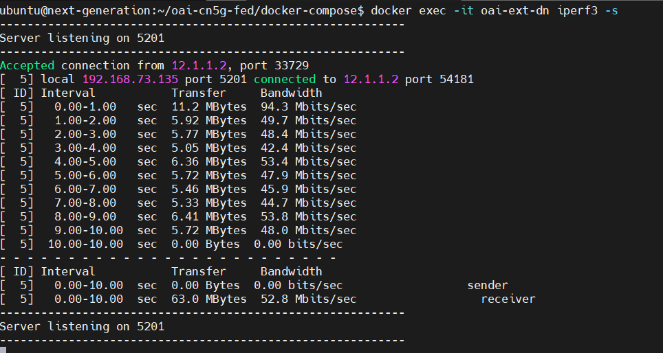
    - run secondly the client
        

6. Next, we can scale the umber of UEs (_NUMBER_OF_UE_).
```
cd oai-cn5g-fed/docker-compose
```
```
nano docker-compose-ueransim-vpp.yaml
```
Change the _NUMBER_OF_UE_  from 1 to 100
```
NUMBER_OF_UE=100
```
Update the UERANSIM or RESTART it
```
docker-compose -f docker-compose-ueransim-vpp.yaml up -d
```
- Test OAI 5G Core with UERANSIM - using ueransim40 interface
 
 - Test OAI 5G Core with UERANSIM - using IP address
 
 - Display the information and the status into the container
 ```
 docker exec -it ueransim ./nr-cli imsi-208950000000040
 ``` 
  
    

### Undeploy/stop the deployment
Make sure you're into the folder _oai-cn5g-fed/docker-compose_
- Stop OAI 5G core basic
```
python3 core-network.py --type stop-basic --scenario 1
```
- Undeploy OAI 5G core basic
```
docker-compose -f docker-compose-basic-vpp-nrf.yaml down
```
- Undeploy UERANSIM 
```
docker-compose -f docker-compose-ueransim-vpp.yaml down
```
-  Undeploy Core network
```
python3 ./core-network.py --type stop-basic-vpp --fqdn no --scenario 1
```


## OpenAirInterface 5G Core and RAN Network Function Deployment using Helm Charts


## Requirements
- Install [docker and docker-compose](https://docs.docker.com/engine/install/ubuntu/) (Ubuntu/Debian)
- Install [k3s Quick-Start](https://docs.k3s.io/quick-start) in you Linux Machine/VM
- Install [Helm from Script](https://helm.sh/docs/intro/install/) in your Linux Machine/VM
- Recommmeded to use:
    - 4 CPU
    - 16GiB RAM
    - Minimum 50 GiB of storage 
    - Install wireshark
- Install [Helm Spray](https://github.com/ThalesGroup/helm-spray) plugin in your Linux Machine/VM
- (Optional) Multus CNI if using multiple interfaces for NFs

## 1. Clone the git repository
```
git clone -b <Branch> https://gitlab.eurecom.fr/oai/cn5g/oai-cn5g-fed
```
## 2. Configuring Helm Charts
```
cd oai-cn5g-fed
ls charts/
oai-5g-core  oai-5g-ran
ls charts/oai-5g-core/
mysql  oai-5g-advance  oai-5g-basic  oai-5g-mini  oai-amf  oai-ausf  oai-nrf  oai-nssf  oai-smf  oai-traffic-server  oai-udm  oai-udr  oai-upf
ls charts/oai-5g-ran/
oai-cu  oai-cu-cp  oai-cu-up  oai-du  oai-gnb  oai-nr-ue

```
- The structure of all these folders is similar as below described
```
oai-5g-basic/
├── Chart.yaml
├── config.yaml
├── README.md
├── templates
│   └── configmap.yaml
└── values.yaml

1 directory, 5 files
```
- Helm chart of every network function looks similar and has the below structure. Only the chart of mysql database and NRF is different.
```
Network_function/
├── Chart.yaml
├── config.yaml
├── README.md
├── templates
│   ├── configmap.yaml
│   ├── deployment.yaml
│   ├── _helpers.tpl
│   ├── multus.yaml
│   ├── NOTES.txt
│   ├── rbac.yaml
│   ├── serviceaccount.yaml
│   └── service.yaml
└── values.yaml

1 directory, 12 files
```
## 3. Create namespace, display namespace
Create a namespace where the helm-charts will be deployed, in our environment we deploy them in oai-tutorial namespace. To create a namespace use the below command on your cluster.
- create namespace
```
kubectl create ns oai-tutorial
```
- display namespace
```
kubectl get namespace
```
## 4. Networking related information
- Configure Multiple Interfaces <br>
To configure multus for AMF, SMF or UPF, in values.yaml of each network function edit the multus section.<br>
```
## Example from oai-amf/values.yaml
multus:
  ## If you don't want to add a default route in your pod then leave this field empty
  defaultGateway: "172.21.7.254"
  n2Interface:
    create: false
    Ipadd: "172.21.6.94"
    Netmask: "22"
    ## If you do not have a gateway leave the field empty
    Gateway:
    ## If you do not want to add any routes in your pod then leave this field empty
    routes: [{'dst': '10.8.0.0/24','gw': '172.21.7.254'}]
    hostInterface: "bond0" # Interface of the host machine on which this pod will be scheduled
```
- Use Single Interface <br>
In values.yaml of AMF, SMF and UPF in multus section do multus.create false like below:
```
## Example from oai-amf/values.yaml
multus:
  n2Interface:
    create: false
```
## 4. Configuring Helm Chart Parameters
In the [config.yaml](https://gitlab.eurecom.fr/oai/cn5g/oai-cn5g-fed/-/blob/master/charts/oai-5g-core/oai-5g-basic/config.yaml) of oai-5g-basic helm charts you will see the configurable parameters for all the network functions check, the PLMN, DNN and subscriber information in mysql database. <br>
For basic and advance deployment check the database [oai_db-basic.sql](https://gitlab.eurecom.fr/oai/cn5g/oai-cn5g-fed/-/blob/master/charts/oai-5g-core/mysql/initialization/oai_db-basic.sql)<br>
To add the entry before deploying the core network, make sure you have all the required subscriber information IMSI(ueid/supi), Key(encPermanentKey), OPC(encOpcKey), PLMN, NSSAI(SST, SD), DNN. <br>
```
 vim/vi/nano charts/oai-5g-core/mysql/initialization/oai_db-basic.sql
# Add a new or edit existing entries after AuthenticationSubscription table
INSERT INTO `AuthenticationSubscription` (`ueid`, `authenticationMethod`, `encPermanentKey`, `protectionParameterId`, `sequenceNumber`, `authenticationManagementField`, `algorithmId`, `encOpcKey`, `encTopcKey`, `vectorGenerationInHss`, `n5gcAuthMethod`, `rgAuthenticationInd`, `supi`) VALUES
('208990100001124', '5G_AKA', 'fec86ba6eb707ed08905757b1bb44b8f', 'fec86ba6eb707ed08905757b1bb44b8f', '{\"sqn\": \"000000000020\", \"sqnScheme\": \"NON_TIME_BASED\", \"lastIndexes\": {\"ausf\": 0}}', '8000', 'milenage', 'c42449363bbad02b66d16bc975d77cc1', NULL, NULL, NULL, NULL, '208990100001124');
# Add the PDN/DNN information after SessionManagementSubscriptionData table
# To assign a static ip-address use the below entry
INSERT INTO `SessionManagementSubscriptionData` (`ueid`, `servingPlmnid`, `singleNssai`, `dnnConfigurations`) VALUES 
('208990100001124', '20899', '{\"sst\": 1, \"sd\": \"10203\"}','{\"oai\":{\"pduSessionTypes\":{ \"defaultSessionType\": \"IPV4\"},\"sscModes\": {\"defaultSscMode\": \"SSC_MODE_1\"},\"5gQosProfile\": {\"5qi\": 6,\"arp\":{\"priorityLevel\": 1,\"preemptCap\": \"NOT_PREEMPT\",\"preemptVuln\":\"NOT_PREEMPTABLE\"},\"priorityLevel\":1},\"sessionAmbr\":{\"uplink\":\"100Mbps\", \"downlink\":\"100Mbps\"},\"staticIpAddress\":[{\"ipv4Addr\": \"12.1.1.85\"}]}}');
INSERT INTO `SessionManagementSubscriptionData` (`ueid`, `servingPlmnid`, `singleNssai`, `dnnConfigurations`) VALUES 
('208990100001125', '20899', '{\"sst\": 1, \"sd\": \"10203\"}','{\"oai\":{\"pduSessionTypes\":{ \"defaultSessionType\": \"IPV4\"},\"sscModes\": {\"defaultSscMode\": \"SSC_MODE_1\"},\"5gQosProfile\": {\"5qi\": 6,\"arp\":{\"priorityLevel\": 1,\"preemptCap\": \"NOT_PREEMPT\",\"preemptVuln\":\"NOT_PREEMPTABLE\"},\"priorityLevel\":1},\"sessionAmbr\":{\"uplink\":\"100Mbps\", \"downlink\":\"100Mbps\"}}}');
```
In the config file smf.use_local_subscription_info should be yes to use the user DNN subscription information from the database. Else it will be used as defined in the configuration file.<br>
Once the charts are configured perform helm dependency update inside the chart repository.
```
cd charts/oai-5g-core/oai-5g-basic
helm dependency update
```
## 5. helm install basic oai-5g-basic
Helm charts have an order of deployment for the proper configuration of core network.
Once the configuration is finished the charts can be deployed with a user who has the rights to

- Create RBAC (Optional only if Openshift is used)
- Run pod (only UPF needs that) with privileged and anyuid scc (optional only required if you have scc configure in your cluster)
- Create multus binds (optional only if multus is used)

```
helm install basic oai-5g-basic -n oai-tutorial
```
- Or you can deploy using Helm Spray plugin
```
cd charts/oai-5g-core/oai-5g-basic
helm plugin install https://github.com/ThalesGroup/helm-spray
helm spray --namespace oai-tutorial .
```
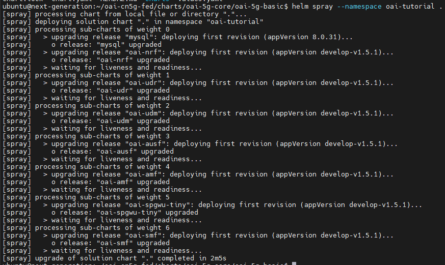
- Display deployments
```
kubectl get deployments -n oai-tutorial
```
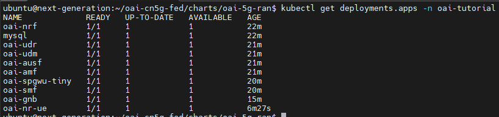
- Display pods
```
kubectl get pods -n oai-tutorial
```
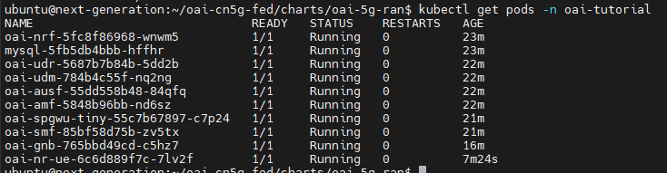
- Display services
```
kubectl get services -n oai-tutorial
```
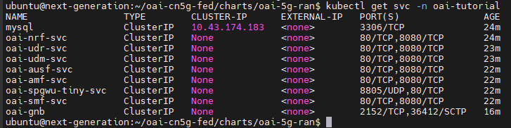

## 6. How to check if the Core network is properly configured?
```
kubectl logs -l app.kubernetes.io/name=oai-smf -n oai-tutorial | grep 'handle_receive(16 bytes)' | wc -l
```
```
kubectl logs -l app.kubernetes.io/name=oai-upf -n oai-tutorial | grep 'handle_receive(16 bytes)' | wc -l
```
## 7. Configuring OAI-gNB RFSimulator and OAI-NR-UE
Very Important To access internet in NR-UE the N6/SGI interface of UPF should be able access the internet.<br>
GNB requires the ip-address or service name of AMF. In case in AMF multus is used and N1/N2 interface is bind to multus interface, then please provide AMF ip-address.
For this tutorial we are not using multus here for similicity, generally there should be two interfaces of gNB(for N2 and N3).<br>
```
## oai-gNB configuration from values.yaml
config:
  timeZone: "Europe/Paris"
  useAdditionalOptions: "--sa -E --rfsim --log_config.global_log_options level,nocolor,time"
  gnbName: "oai-gnb-rfsim"
  mcc: "001"   # check the information with AMF, SMF, UPF
  mnc: "01"    # check the information with AMF, SMF, UPF
  tac: "1"     # check the information with AMF
  sst: "1"  #currently only 4 standard values are allowed 1,2,3,4
  usrp: rfsim   #allowed values rfsim, b2xx, n3xx or x3xx
  amfhost: "oai-amf"  # amf ip-address or service-name oai-amf-svc or 172.21.6.94
  n2IfName: "eth0"    # if multus.n2Interface.create is true then use n2
  n3IfName: "eth0"
```
## 8. Deploy OAI-gNB RFSimulator
```
cd ../../oai-5g-ran/
helm install gnb oai-gnb --namespace oai-tutorial
```
- Wait for the gNB to start
```
kubectl wait --for=condition=ready pod -l app.kubernetes.io/name=oai-gnb --timeout=3m --namespace oai-tutorial
```
- To check if gnB is connected, read the logs of amf and check N2 setup procedure was correct or not,
```
kubectl logs --namespace oai-tutorial $(kubectl get pods --namespace oai-tutorial | grep oai-amf| awk '{print $1}') | grep 'Connected'
```
## 9. Configure OAI-NR-UE RFSimulator
Please change timeZone according to your location
```
config:
  timeZone: "Europe/Paris"
  rfSimServer: "oai-du"    # ip-address of rfsim or service name oai-gnb in case of du change it with oai-du if multus is true then provide ip-address of oai-gnb
  fullImsi: "001010000000100"       # make sure all the below entries are present in the subscriber database
  fullKey: "fec86ba6eb707ed08905757b1bb44b8f" 
  opc: "C42449363BBAD02B66D16BC975D77CC1"
  dnn: "oai"
  sst: "1"                     # configure according to gnb and amf, smf and upf 
  sd: "16777215"
  usrp: "rfsim"            # allowed rfsim, b2xx, n3xx, x3xx
  useAdditionalOptions: "--sa --rfsim -r 106 --numerology 1 -C 3619200000 --nokrnmod --log_config.global_log_options level,nocolor,time"

```
## 10. Deploy OAI-NR-UE RFSimulator
```
helm install nrue oai-nr-ue/ --namespace oai-tutorial
```
## 11. Results after tests
- Test of connectivity using ping util tool (UE1)
```
kubectl -n oai-tutorial exec -it pods/oai-nr-{your id pod here} -- /bin/bash
```
Into container pod, display the availables interfaces
```
ip address
```
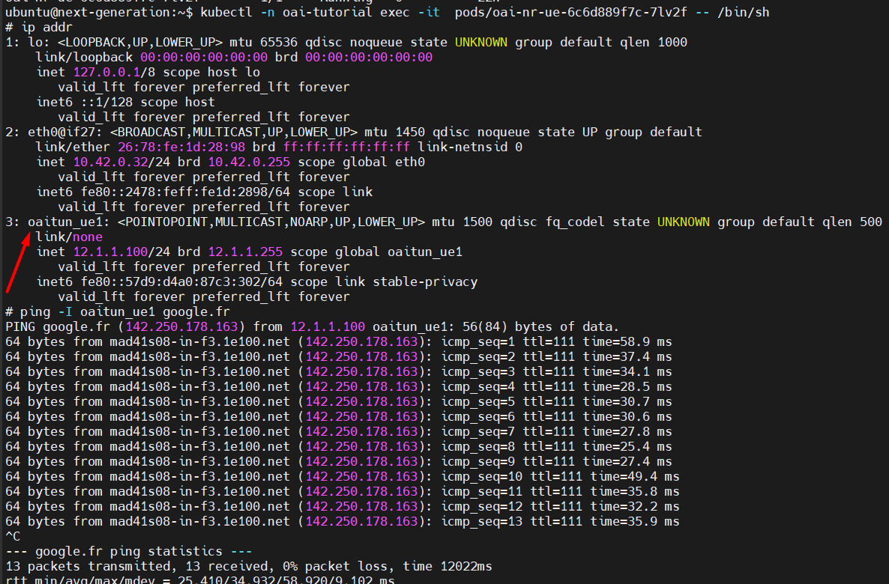

- Test connectivty directly from cluster
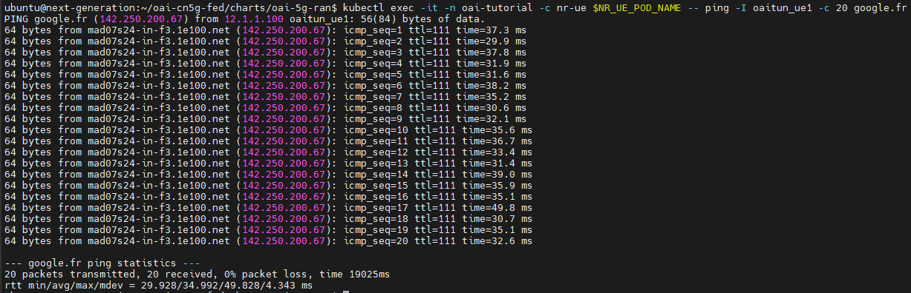

- Test of connectivity using ping util tool (oaitun_ue1 interface) into container pod <br>
Again into container pod install this tool
```
apt update && apt get install tcpdump
```
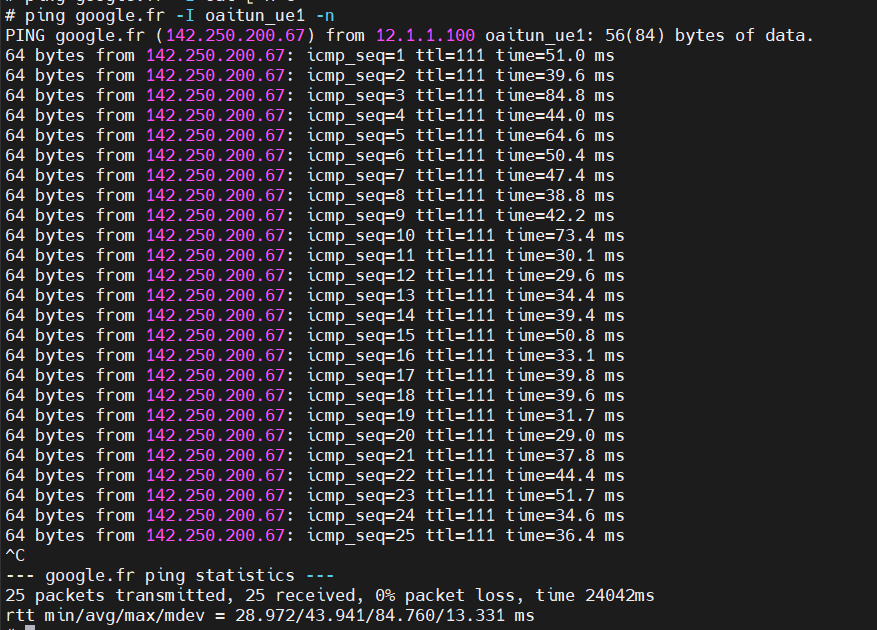

Leave the previous ping running and make tcpdump in UPF/oai-nr container pod.
```
kubectl -n oai-tutorial exec -it pods/oai-nr-{your id pod here} -- /bin/bash
```
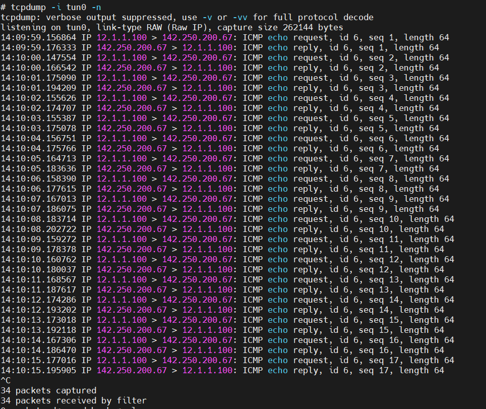

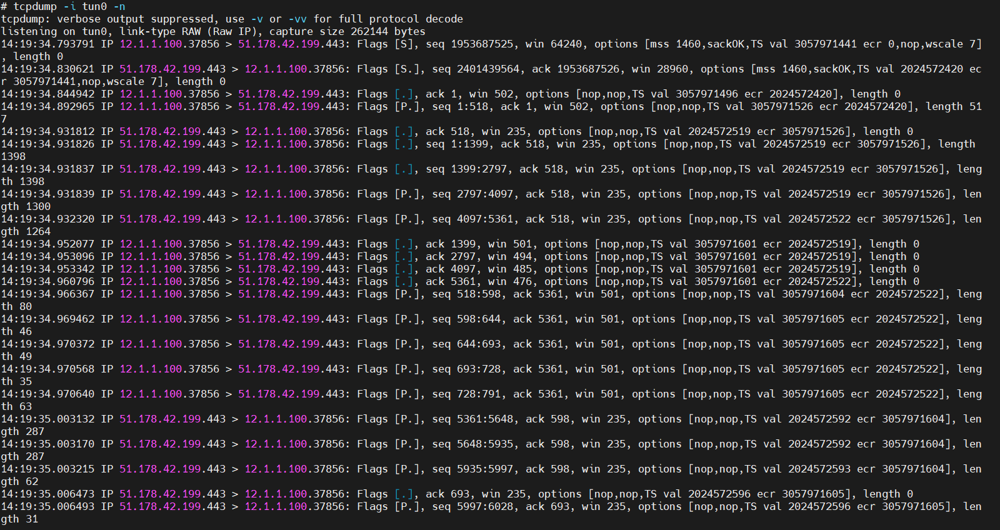

- Test performace using iperf3
Into oai-nr container pod install iperf3
```
apt update && apt install iperf3
```
- Please, do in this order to test performance using iperf3
    - First connect the server(UPF/oai-nr)
    - second connect the client(UE1)

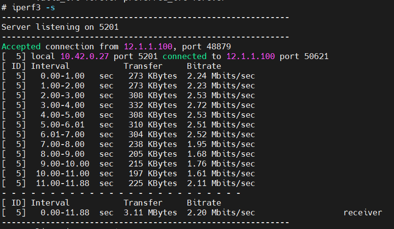

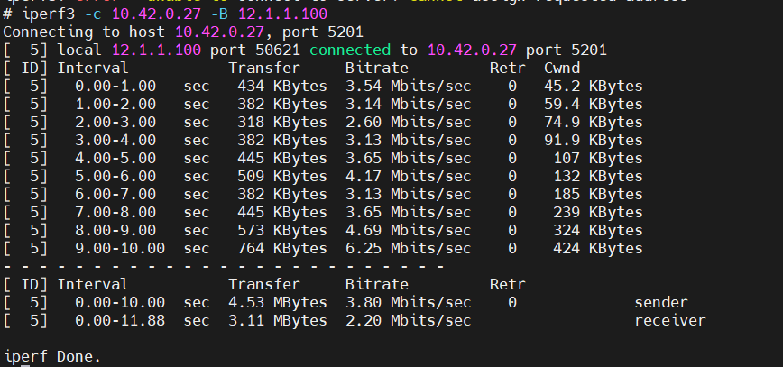


## Clean OAI deployments using K8S
- clean oai deployments
```
helm uninstall basic -n oai-tutorial
```
- clean helm spray plugin
```
helm plugin uninstall spray
```


## References
[OAI 5G Core Network Documentation](https://openairinterface.org/oai-5g-core-network-project/) <br>
[5G Core Network Basic Deployment using Docker-Compose](https://gitlab.eurecom.fr/oai/cn5g/oai-cn5g-fed/-/blob/master/docs/DEPLOY_SA5G_WITH_UERANSIM.md) <br>
[URANSIM OAI Oficial Tutorial](https://gitlab.eurecom.fr/oai/cn5g/oai-cn5g-fed/-/blob/master/docs/DEPLOY_SA5G_WITH_UERANSIM.md) <br>
[GNBSIM OAI Oficial Tutorial](https://gitlab.eurecom.fr/oai/cn5g/oai-cn5g-fed/-/blob/master/docs/DEPLOY_SA5G_MINI_WITH_GNBSIM.md) <br>
[OAI gneral Docs Tutoril - GitLab](https://gitlab.eurecom.fr/oai/cn5g/oai-cn5g-fed/-/blob/master/docs/DEPLOY_HOME.md)