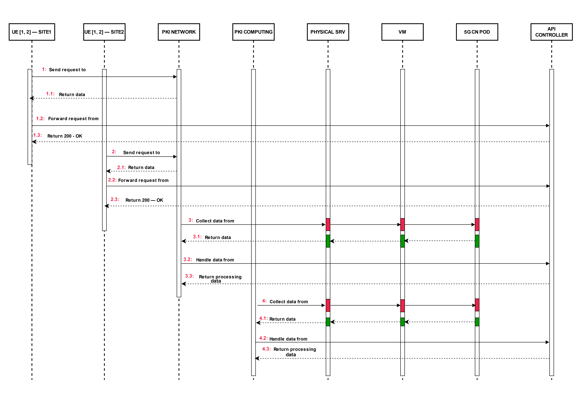

# Edge Internet Traffic Steering Architecture -  Sequential Diagram

## Sequential Flow Description

### 1. User Equipment (UE) [1, 2] — SITE1 sends a request
- **Step 1**: UE at SITE1 sends a request.
- **Step 1.1**: The request data is returned.
- **Step 1.2**: The request is forwarded from UE at SITE1 to UE at SITE2.
- **Step 1.3**: UE at SITE2 returns a "200 — OK" response.

### 2. User Equipment (UE) [1, 2] — SITE2 sends a request
- **Step 2**: UE at SITE2 sends a request.
- **Step 2.1**: The request data is returned.
- **Step 2.2**: The request is forwarded from UE at SITE2 to the PKI Network.
- **Step 2.3**: PKI Network returns a "200 — OK" response.

### 3. PKI Network collects data
- **Step 3**: PKI Network collects data from PKI Computing.
- **Step 3.1**: PKI Computing returns the data.
- **Step 3.2**: PKI Network handles the data from PKI Computing.
- **Step 3.3**: PKI Network returns processing data to the Physical Server.

### 4. Physical Server collects data
- **Step 4**: Physical Server collects data from the VM.
- **Step 4.1**: VM returns the data.
- **Step 4.2**: Physical Server handles the data from the VM.
- **Step 4.3**: Physical Server returns processing data to the 5G CN Pod.
