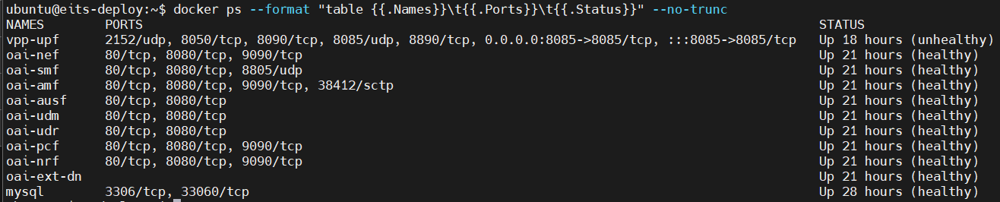
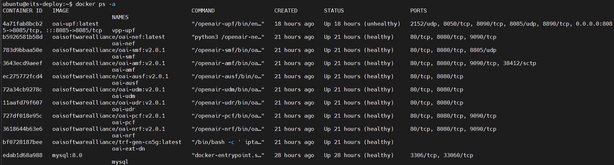
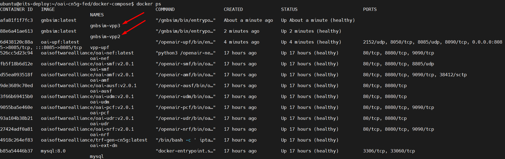
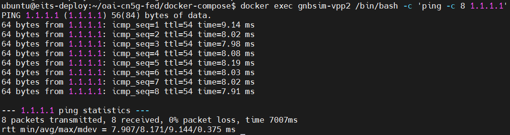
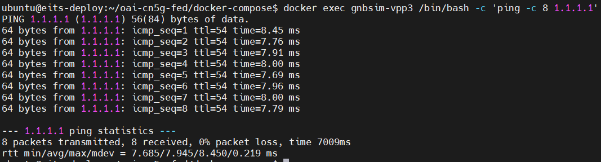

# Edge Internet Traffic Steering - Thesis
**Objective**: The objective of this thesis is to develop a solution where a network edge node makes a decision based 
on the metrics of interest, and then steers the traffic to a node that serves a service instance, for example
using a tunnel.
## Iº - OpenAirInterface 5G Core Traffic Steering/steering Network Deployment and Testing With Gnbsim

In total, 3 different docker networks are used:

- public_net (demo-oai) for control plane
- public_net_access (cn5g-access) for the N3 interface between gnbsim and gNB
- public_net_core (cn5g-core) for the N6 interface between UPF and DN
## Requirements
The installation can be done directly over the host operating system (OS) or inside a virtual machine (VM OpenStack).

### System requirements
- Install [docker](https://docs.docker.com/engine/install/ubuntu/) for Ubuntu 22.04
- CPU type: x86-64 (specific model and number of cores only affect performance)
- RAM: 6 GB, 8vCPU
- Disk space: 40 GB
- Ubuntu 22.04 LTS Jammy
### Building Container image or Retrieving Container image
- Create a folder where you can store all the result files of the tutorial and later compare them with our provided result files. We recommend creating exactly the same folder to not break the flow of commands afterward.
```
mkdir -p /tmp/oai/steering-scenario
```
```
chmod 777 /tmp/oai/steering-scenario
```
- Now, you can build images by [retrieving images](https://gitlab.eurecom.fr/oai/cn5g/oai-cn5g-fed/-/blob/master/docs/RETRIEVE_OFFICIAL_IMAGES.md), using Script or [building container image](https://gitlab.eurecom.fr/oai/cn5g/oai-cn5g-fed/-/blob/master/docs/BUILD_IMAGES.md)
```
bash pull-oai-images-v201.sh
```
### Deployment and Tracing
The first interface (demo-oai) is used for the control plane, including the N4 interfaces to all UPFs. The others are used for the user plane.<br>
Therefore, we do not need to filter out the UP when tracing on the demo-oai interface.
We run the mysql service first, so that we can start the trace before anything is sent over the CP.
You can choose to skip this step and deploy all the NFs at once.
```
docker-compose -f docker-compose-basic-vpp-pcf-steering.yaml up -d mysql 

Creating network "demo-oai-public-net" with driver "bridge"
Creating network "oai-public-access" with the default driver
Creating network "oai-public-core-pri" with the default driver
Creating network "oai-public-core-sec" with the default driver
Creating mysql ... done

```

We capture the packets on the docker networks and filter out ARP.
```
sleep 1
```
```
nohup sudo tshark -i demo-oai -f "not arp" -w /tmp/oai/steering-scenario/control_plane.pcap > /tmp/oai/steering-scenario/control_plane.log 2>&1 &
```
Then, we start all the NFs.
```
docker-compose -f docker-compose-basic-vpp-pcf-steering.yaml up -d

mysql is up-to-date
Creating oai-nrf             ... done
Creating oai-udr             ... done
Creating vpp-upf             ... done
Creating oai-pcf             ... done
Creating oai-udm             ... done
Creating oai-ext-dn          ... done
Creating oai-ausf            ... done
Creating oai-amf             ... done
Creating oai-smf             ... done
```
- Note: Here we use two docker subnets for N6, that is oai-public-core-pri and oai-public-core-sec, which terminates to DN over two different ipv4 subnets. Operator can have different termination endpoints for these multiple N6 interfaces, e.g. one could terminate to regular internet DN and another could be local edge server etc.<br>
### Checking the Status of the NFs
Using docker ps you can verify that no NF exited, e.g. because of a faulty configuration:<br>
Also all should be in an healthy state before going further. The mysql container may take some time.
<br>


### Simulate with gnbsim
When the CN is deployed successfully, we can simulate a gNB and UE using gnbsim.
Please see the [gnbsim tutorial](https://gitlab.eurecom.fr/oai/cn5g/oai-cn5g-fed/-/blob/master/docs/DEPLOY_SA5G_MINI_WITH_GNBSIM.md) on how to retrieve or build the image.
- Instantiate first Gnbsim instance (IMSI - 208950000000032)
```
docker-compose -f docker-compose-gnbsim-vpp-additional.yaml up -d gnbsim-vpp2
Creating gnbsim-vpp2 ...
Creating gnbsim-vpp2 ... done
```
- Instantiate second Gnbsim instance (IMSI - 208950000000033)
```
docker-compose -f docker-compose-gnbsim-vpp-additional.yaml up -d gnbsim-vpp3
Creating gnbsim-vpp3 ...
Creating gnbsim-vpp3 ... done
```
 <br>
We can verify that both the UEs received an IP address and that the PDU session establishment was successful.
```
docker logs gnbsim-vpp2 2>&1 | grep "UE address:"
[gnbsim]2024/03/21 09:56:33.107207 example.go:332: UE address: 12.1.1.3
```
```
docker logs gnbsim-vpp3 2>&1 | grep "UE address:"
[gnbsim]2024/03/21 09:57:01.064667 example.go:332: UE address: 12.1.1.4
```
It can take some time until the PDU session establishment is complete, so you may have to repeat this command until you see the IP address.<br>
### Traffic Test for Steering
Note: _As tshark is running in the background, and we run everything in the same terminal, we will stop the control plane traces here. If you want, you can open tshark on another terminal and terminate it whenever it suits you._

```
sudo pkill tshark 
```
```
sleep 5
```
Before we start the traffic tests, we start the user plane trace without any filter:
```
nohup sudo tshark -i cn5g-access -i cn5g-core-pri -i cn5g-core-sec  -w /tmp/oai/steering-scenario/user_plane_steering.pcap > /tmp/oai/steering-scenario/user_plane_steering.log 2>&1 &
```
This capture contains all the UP network interfaces.<br>
Please make a note that,
- In the policy decisions file (policies/steering/policy_decisions/policy_decision.yaml), we configure UE IMSI with PCC rule to be used. We can verify that the UE with the IMSI 208950000000032 is configured to use the PCC rule steering-rule-primary, whereas UE with the IMSI 208950000000033 is configured to use the PCC rule steering-rule-secondary
- Moreover, the PCC rules (policies/steering/pcc_rules/pcc_rules.yaml) configured for steering contains  flowDescription as permit out ip from any to assigned which is basically means that, to allow all kind of UE traffic and steer the traffic to one of N6 interface of UPF as per traffic control rule defined in policies/steering/traffic_rules/traffic_rule.yaml.
- As you can see below, in the traffic contorl rule (policies/steering/traffic_rules/traffic_rule.yaml) we use DNAI of the interface at UPF to steer the traffic to one of the N6 interface.
```
steering-scenario-primary:
  routeToLocs:
    - dnai: access
    - dnai: internet-primary

steering-scenario-secondary:
  routeToLocs:
    - dnai: access
    - dnai: internet-secondary
```
Now, we generate ICMP traffic to 1.1.1.1 from UE1:
```
docker exec gnbsim-vpp2 /bin/bash -c 'traceroute -4 -T -s 12.1.1.2 1.1.1.1' 
```
```
docker exec gnbsim-vpp2 /bin/bash -c 'ping -c 8 1.1.1.1'
```
 <br>
Then, we generate ICMP traffic to 1.1.1.1 from UE2:
```
docker exec gnbsim-vpp3 /bin/bash -c 'traceroute -4 -T -s 12.1.1.3 1.1.1.1'
```
```
docker exec gnbsim-vpp3 /bin/bash -c 'ping -c 8 1.1.1.1'
```
 <br>

### Trace Analysis
Now that we have captured control plane and user plane traces, we can stop tshark:<br>
```
sudo pkill tshark
```
Then, we change the permissions of the traces to open them in Wireshark:<br>
```
sudo chmod 666 /tmp/oai/steering-scenario/control_plane.*
sudo chmod 666 /tmp/oai/steering-scenario/user_plane_steering.*
```
### Steering Scenario
The results of this tutorial are located in results/steering.<br>
We can verify the PDU session details as per UPF session logs. We should note that the forwarding rule set for UE 1 (12.1.1.3), is with network instance internet.oai.org.pri. Which means all the UE 1 (12.1.1.3) traffic will be sent to DN over primary interface of the UPF.<br>
```
FAR: 1
  Apply Action: 00000002 == [FORWARD]
  Forward:
    Network Instance: internet.oai.org.pri
    Destination Interface: 1
```
Moreover, we should also note that the forwarding rule set for UE 1 (12.1.1.4), is with network instance internet.oai.org.sec. Which means all the UE 1 (12.1.1.3) traffic will be sent to DN over secondary interface of the UPF.<br>
```
FAR: 1
  Apply Action: 00000002 == [FORWARD]
  Forward:
    Network Instance: internet.oai.org.sec
    Destination Interface: 1
```

## IIº - Edge Internet Traffic Steering - OAI 5G Core Traffic - API Metrics deployment Component

## Undeploy Network Functions
When you are done, you can undeploy the gnbsim instances and stop the NFs.<br>
First, we stop the gnbsim instances:
```
docker-compose -f docker-compose-gnbsim-vpp-additional.yaml stop -t 2
```
Then, we stop the NFs.<br>
```
docker-compose -f docker-compose-basic-vpp-pcf-steering.yaml stop -t 2
```
Now we are able to collect the logs.<br>
```
docker logs oai-amf > /tmp/oai/steering-scenario/amf.log 2>&1
docker logs oai-smf > /tmp/oai/steering-scenario/smf.log 2>&1
docker logs oai-nrf > /tmp/oai/steering-scenario/nrf.log 2>&1
docker logs vpp-upf > /tmp/oai/steering-scenario/vpp-upf.log 2>&1
docker logs oai-udr > /tmp/oai/steering-scenario/udr.log 2>&1
docker logs oai-udm > /tmp/oai/steering-scenario/udm.log 2>&1
docker logs oai-ausf > /tmp/oai/steering-scenario/ausf.log 2>&1
docker logs oai-pcf > /tmp/oai/steering-scenario/pcf.log 2>&1
docker logs gnbsim-vpp2 > /tmp/oai/steering-scenario/gnbsim-vpp2.log 2>&1
docker logs gnbsim-vpp3 > /tmp/oai/steering-scenario/gnbsim-vpp3.log 2>&1
```
Finally, we undeploy the gnbsims and NFs to clean up the Docker networks.<br>
```
docker-compose -f docker-compose-gnbsim-vpp-additional.yaml down -t 2
```
```
docker-compose -f docker-compose-basic-vpp-pcf-steering.yaml down -t 2
```