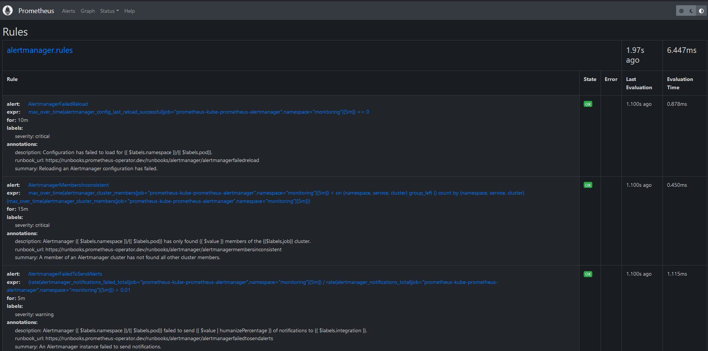

# Instructions to deploy Open5GS using K8S
- [Requirements](#requirements)
    - [Systems Requirements](#system-requirements)
    - [Configurations Steps](#configuration-steps)
- [Ready to deploy open5gs](#now-we-are-ready-to-deploy-open5gs-and-ueransim)
- [Very the deployments](#verify-deployment)
- [References](#references)


## Requirements
The installation can be done directly over the host operating system (OS) or inside a virtual machine (VM).
In our case we have deployed it using VM in Openstack.

#### System requirements

- CPU type: x86-64 (specific model and number of cores only affect performance)
- RAM: 2 GB, 2vCPU (it's recommendable to use 4GB/8GB if you use more than 10 nodes)
- Disk space: 25GB (it's recommendable to use 40 GB)
- Ubuntu Cloud 22.04 LTS

#### Configuration steps
The following steps are required to complete setup.

1. Install python 3.8 (or latest)
```
sudo apt update && apt -y install python3.8
```
2. Install git
```
sudo apt -y install git
```
3. Install docker
```
sudo apt install -y docker.io
```
Add docker to a user Group
```
sudo usermod -aG docker $USER
```
Reboot your VM
```
sudo reboot now
```

4. Install k3s via script
```
curl -sfL https://get.k3s.io | sh -
```
Verify somes k8s components
```
kubectl get nodes
```
```
kubectl get po -A
```
To install additional agent nodes and add them to the cluster, run the installation script with the K3S_URL and K3S_TOKEN environment variables. Here is an example showing how to join an agent: <br>
```
curl -sfL https://get.k3s.io | K3S_URL=https://myserver:6443 K3S_TOKEN=mynodetoken sh -
```
5. Install Helm
```
curl -fsSL -o get_helm.sh https://raw.githubusercontent.com/helm/helm/main/scripts/get-helm-3
```
```
chmod 700 get_helm.sh
```
```
./get_helm.sh
```
6. Optionaly you can install istio via script
```
curl -L https://istio.io/downloadIstio | sh -
```
7. Or using spefecic version
```
curl -L https://istio.io/downloadIstio | ISTIO_VERSION=1.19.3 TARGET_ARCH=x86_64 sh -
```
Add the istioctl client to your path (Linux or macOS):
```
export PATH=$PWD/bin:$PATH
```
Now install this version
```
istioctl install --set profile=demo -y
```
Add a namespace label to instruct Istio to automatically inject Envoy sidecar proxies when you deploy your application later:
```
kubectl label namespace default istio-injection=enabled
```
**Obs.: the namespace can be that you have created for deployment

### Now we are ready to deploy Open5gs and UERANSIM

8. First all, create the namespace
```
kubectl create namespace open5gs
```
9. Add the helm repo to your Helm
```
helm repo add openverso https://gradiant.github.io/openverso-charts/
```
10. Deployment NGC and registration of subscribers
```
helm -n open5gs install open5gs openverso/open5gs --version 2.0.8 --values https://gradiant.github.io/openverso-charts/docs/open5gs-ueransim-gnb/5gSA-values.yaml 
```
These new values will:
- Disable the Open5gs EPC, deploying only the functions of the Open5gs 5G SA Core.
- nable the populate option, which will create a Deployment using the openverso/open5gs-dbctl image. This will provide an easy way to manage the subscribers. In addition, the initCommands specified will register two subscribers initially, with the imsi, key, opc, apn, sst and sd provided.
- Disable the Ingress for accessing the Open5GS WebUI.
11. Deployment RAN
```
helm -n open5gs install ueransim-gnb openverso/ueransim-gnb --version 0.2.2 --values https://gradiant.github.io/openverso-charts/docs/open5gs-ueransim-gnb/gnb-ues-values.yaml 

```
Thus, this deployment will not only launch the **gNodeB**, but it will also enable the launching of 2 UEs. They will use consecutive MSIDNs, starting from the value of **ues.initialMSISDN** (0000000001, by default). <br>
It is important to notice that the default values of **mcc**, **mnc**, **sst**, **sd** and tac match those configured in the **open5gs** chart and the registered UEs. <br>

### Verify deployment 
We can verify some importants components like **deployments**, **services**, **pods**, etc.

 
  
   

12. Connection between SMF and UPF (C-Plane and U-Plane of NGC) <br>

Check that the SMF gets associated with the UPF’s address:
```
kubectl -n open5gs logs deployment/open5gs-smf -f
```
 

 13. Connection between AMF and gNodeB <br>
 Check that the AMF accepts and adds the gNodeB:
 ```
 kubectl -n open5gs logs deployment/open5gs-amf -f
 ```
 
 

 Check that gNodeB establishes SCTP connection successfully and that the NG Setup procedure was successful as well:
 ```
 kubectl -n open5gs logs deployment/ueransim-gnb -f
 ```
  

  14. UE’s connectivity <br>
Check that both UEs established their PDU Session successfully, creating each of them one tunnel interface (uesimtun0 and uesimtun1):
```
kubectl exec deployment/ueransim-gnb-ues -ti -- bash
```
```
ip addr
```
Or install net-tools to use ifconfig
```
apt install net-tools
```
```
ifconfig
```
  

15. Check that UEs have connectivity through these interfaces: <br>
```
ping gradiant.org -I uesimtun0
```
```
ping gradiant.org -I uesimtun1
```


It’s even possible to check that the UEs’ traffic is being routed correctly through their PDU sessions, capturing the packets in the UPF. The installation of tcpdump in the corresponding pod is needed in order to complete this check: <br>
```
kubectl exec deployment/open5gs-upf -ti -- bash
```
```
apt update && apt install tcpdump
```
```
tcpdump -i ogstun
```


**Note:** we can register others UEs using WEBUI ou via CLI.
- Via WEBUI
    - URL: http://[your ip address]:3000 (or your node port)
    - Username: admin
    - Password: 1423


- Via CLI  <br>
**Additional subscribers using open5gs-populate** <br>
Once the NGC is deployed, we can register additional subscribers at any time by using the Deployment previously described: 
```
kubectl exec deployment/open5gs-populate -ti -- bash
```
From there, we can register a new subscriber by executing the following command, providing the corresponding values for imsi, key, opc, apn, sst and sd:
```
open5gs-dbctl add_ue_with_slice <imsi> <key> <opc> <apn> <sst> <sd>
```
After that, the changes can be verified following 2 different approaches: <br>
 **1. Directly through MongoDB**
 ```
 kubectl exec deployment/open5gs-mongodb -ti -- bash
 ```
 **2. Using the Open5GS WebUI** <br>
This cmd below is accomplished if you run your open5GS locally
 ```
 kubectl port-forward svc/open5gs-webui 3000:3000
 ```


## Clean 
 - Clean the deployment for this demo by uninstalling the 2 helm charts previously installed: <br>
 ```
 helm uninstall ueransim-gnb -n open5gs
 ```
 ```
 helm uninstall open5gs -n open5gs
 ```

 - Unstall k3s Servers
 ```
./usr/local/bin/k3s-uninstall.sh
 ```

 - Uninstalling Agents
 ```
 /usr/local/bin/k3s-agent-uninstall.sh
 ```

 - uninstall Istio <br>
 The Istio uninstall deletes the RBAC permissions and all resources hierarchically under the istio-system namespace. It is safe to ignore errors for non-existent resources because they may have been deleted hierarchically.
 ```
 kubectl delete -f samples/addons
 ```
 ```
 istioctl uninstall -y --purge
 ```
 The istio-system namespace is not removed by default. If no longer needed, use the following command to remove it:
 ```
 kubectl delete namespace istio-system
 ```
 The label to instruct Istio to automatically inject Envoy sidecar proxies is not removed by default. If no longer needed, use the following command to remove it:
 ```
 kubectl label namespace default istio-injection-
 ```

## Monitoring and Observability
To better understand what's happened into container and VM workload level, it was necessary deploying Prometheus and Grafana using K8S.<br>
We installed it using helm tools to quickly deploy Prometheus and Grafana. Please, follow the sequential steps below to implement it. <br>
- Create and display the namespace
```
kubectl create namespace monitoring
kubect get ns
```
- Install Prometheus Community Stack
```
helm install prometheus prometheus-community/kube-prometheus-stack -n monitoring
```
- Display some important components installed
```
kubectl get pods -n monitoring
kubectl get deployments -n monitoring
kubectl get svc -n monitoring
```
- Edit the services(svc) to change from ClusterIP to NodePort to access Prometheus/Grafana externally. Go almost at end of the file, you will see Type: ClusterIP as shown in image below.
```
kubectl edit svc prometheus-grafana -n monitoring
```


- Display again the SVC and you can see the image specifing what to change.
```
kubectl get svc -n monitoring
```


### Accessing Prometheus and Grafana on Web Browser
- For Prometheus
  - Username: not need
  - Password: not need
```
http://your IP address:your prometheus NodePort
```
- Next you can see some images for Prometheus how it looks like.




 <br>


- For Grafana
  - Username: admin
  - Password: prom-operator
```
http://your IP address:your grafana NodePort
```
**OBS.**: Your IP address must be whose from your interface or Public IP. If you're using AWS EC2 or OpenStack, you have to make sure your NodePort is added to your security group to accessed. 

- Next you can see some images for Grafana how it looks like.


**Note:** In the images/monitoring-k8s-open5gs folder you can find several other images to explore. Please, feel free to do it.

### Clean Monitoring
```
helm uninstall promethes -n monitoring
```
You can delete the namespace as well.
```
 kubectl delete namespaces monitoring
```


## References
[Open5GS Documentation Blog](https://open5gs.org/open5gs/) <br>
[Docker Documentation](https://docs.docker.com/engine/install/ubuntu/) <br>
[Istio documentation](https://istio.io/latest/docs/setup/getting-started/) <br>
[Helm documentation](https://helm.sh/docs/intro/install/) <br>
[K8S Open5GS Related Installation](https://gradiant.github.io/openverso-charts/open5gs-ueransim-gnb.html)
