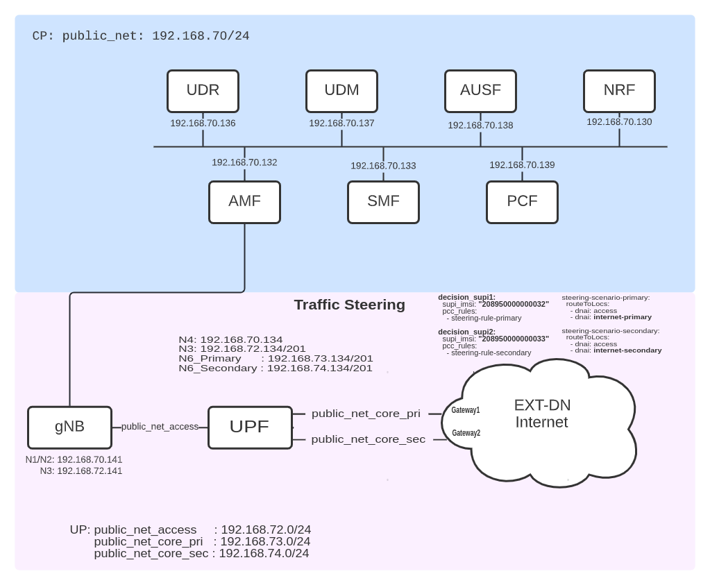
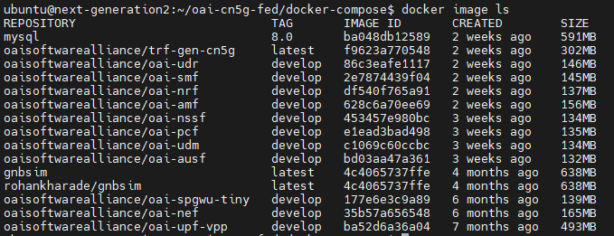
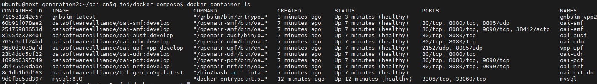
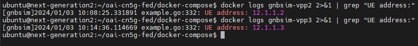
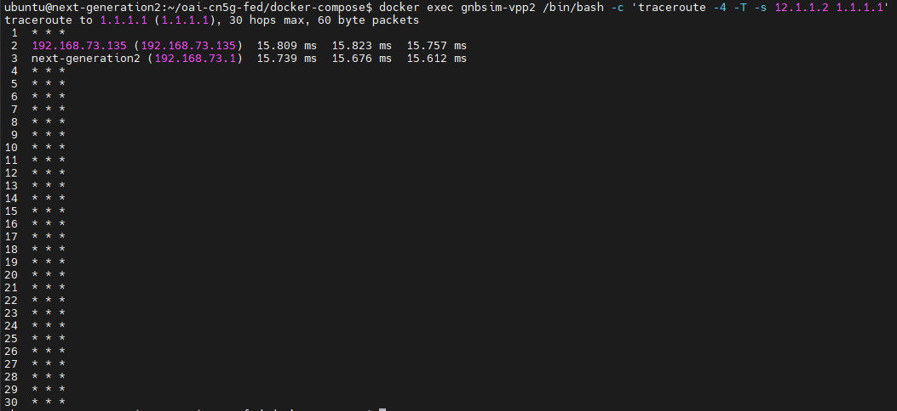
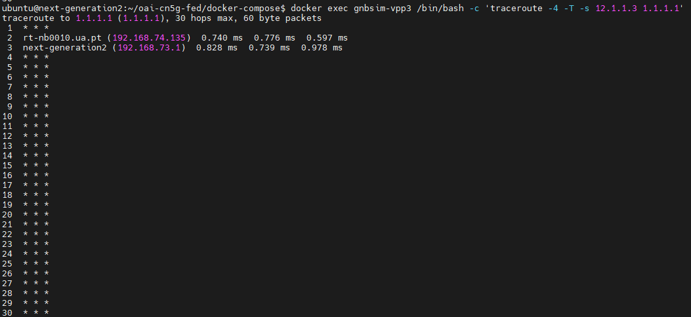

# OpenAirInterface 5G Core Traffic Steering/steering Network Deployment and Testing With Gnbsim

- [Requirements](#requirements)
- [Building Container Images or Retrieving Container Images](#1-building-container-images-or-retrieving-container-images)
- [Deploying OAI 5g Core Network](#2-deploying-oai-5g-core-network)
- [Docker Networks](#docker-networks)
- [Deployment and Tracing](#deployment-and-tracing)
- [Start all the NFs](#start-all-the-nfs)
- [Simulate with gnbsim](#3-simulate-with-gnbsim)
- [Traffic Test for Steering](#4-traffic-test-for-steering)
- [Trace Analysis](#6-trace-analysis)
- [Steering Scenario](#steering-scenario)
- [Undeploy Network Functions](#7-undeploy-network-functions)
- [References](#references)

This tutorial shows how to configure the Traffic Steering feature at SMF and UPF, based on policies from the PCF.


## Requirements
- Install [docker and docker-compose](https://docs.docker.com/engine/install/ubuntu/) (Ubuntu/Debian)
- Recommmeded to use:
    - 8 CPU
    - 6GiB RAM
    - Minimum 1.5 GiB of free storage for docker images
    - Install wireshark
## 1. [Building Container Images](https://gitlab.eurecom.fr/oai/cn5g/oai-cn5g-fed/-/blob/master/docs/BUILD_IMAGES.md) or [Retrieving Container Images](https://gitlab.eurecom.fr/oai/cn5g/oai-cn5g-fed/-/blob/master/docs/RETRIEVE_OFFICIAL_IMAGES.md)

## 2.  Deploying OAI 5g Core Network
We use docker-compose to deploy the core network. Please refer to the file [docker-compose-basic-vpp-pcf-steering.yaml](https://gitlab.eurecom.fr/oai/cn5g/oai-cn5g-fed/-/blob/master/docker-compose/docker-compose-basic-vpp-pcf-steering.yaml)       
for details.
### Docker Networks
In total, 3 different docker networks are used:
- public_net (demo-oai) for control plane
- public_net_access (cn5g-access) for the N3 interface between gnbsim and gNB
- public_net_core (cn5g-core) for the N6 interface between UPF and DN
### Deployment and Tracing
The first interface (demo-oai) is used for the control plane, including the N4 interfaces to all UPFs. The others are used for the user plane.<br>
Therefore, we do not need to filter out the UP when tracing on the demo-oai interface.
We run the mysql service first, so that we can start the trace before anything is sent over the CP.
You can choose to skip this step and deploy all the NFs at once.<br>
```
git clone https://gitlab.eurecom.fr/oai/cn5g/oai-cn5g-fed.git
cd oai-cn5g-fed
git checkout develop
cd docker-compose
```
```
docker-compose -f docker-compose-basic-vpp-pcf-steering.yaml up -d mysql
```
### Start all the NFs.
```
docker-compose -f docker-compose-basic-vpp-pcf-steering.yaml up -d
```

- Checking the images
```
docker image ls
```


- Checking the container ps
```
docker container ls
```


_OBS._: Make sure that all container are healthy.

## 3. Simulate with gnbsim
- Instantiate first Gnbsim instance (IMSI - 208950000000032)
```
docker-compose -f docker-compose-gnbsim-vpp-additional.yaml up -d gnbsim-vpp2
```
- Instantiate second Gnbsim instance (IMSI - 208950000000033)
```
docker-compose -f docker-compose-gnbsim-vpp-additional.yaml up -d gnbsim-vpp3
```
### Checking logs UE1 and UE2


## 4. Traffic Test for Steering

Note: _As tshark is running in the background, and we run everything in the same terminal, we will stop the control plane traces here. If you want, you can open tshark on another terminal and terminate it whenever it suits you._<br>

```
sudo pkill tshark 
sleep 5
```
The user plane trace is started without a filter prior to the traffic tests:
```
nohup sudo tshark -i cn5g-access -i cn5g-core-pri -i cn5g-core-sec  -w /tmp/oai/steering-scenario/user_plane_steering.pcap > /tmp/oai/steering-scenario/user_plane_steering.log 2>&1 &
```
This capture contains all the UP network interfaces.

- Now, we generate ICMP traffic to 1.1.1.1 from UE1:

- Next, we generate ICMP traffic to 1.1.1.1 from UE2:


```
docker exec vpp-upf bin/vppctl show upf session > /tmp/oai/steering-scenario/vpp-upf-steering-session.log 2>&1
```
## 6. Trace Analysis
We can now terminate tshark since we have the control plane and user plane traces captured:
```
sudo pkill tshark
```
Next, we modify the traces' permissions so that Wireshark may open them:
```
sudo chmod 666 /tmp/oai/steering-scenario/control_plane.*
```
```
sudo chmod 666 /tmp/oai/steering-scenario/user_plane_steering.*
```
### Steering Scenario
The results of this tutorial are located in 
[results/steering.](https://github.com/jmgitcloudua/deploy-5g-opensource/tree/main/steering/results)  

We can verify the PDU session details as per UPF session logs. We should note that the forwarding rule set for UE 1 (12.1.1.2), is with network instance internet.oai.org.pri. Which means all the UE 1 (12.1.1.2) traffic will be sent to DN over primary interface of the UPF.<br>
```
FAR: 1
  Apply Action: 00000002 == [FORWARD]
  Forward:
    Network Instance: internet.oai.org.pri
    Destination Interface: 1

```
Moreover, we should also note that the forwarding rule set for UE 1 (12.1.1.3), is with network instance internet.oai.org.sec. Which means all the UE 1 (12.1.1.2) traffic will be sent to DN over secondary interface of the UPF.<br>
```
FAR: 1
  Apply Action: 00000002 == [FORWARD]
  Forward:
    Network Instance: internet.oai.org.sec
    Destination Interface: 1

```
## 7. Undeploy Network Functions
- Stop the gnbsim instances:
```
docker-compose -f docker-compose-gnbsim-vpp-additional.yaml stop -t 2
```
- Stop the NFs
```
docker-compose -f docker-compose-basic-vpp-pcf-steering.yaml stop -t 2
```

Now we are able to collect the logs.<br>

```
docker logs oai-amf > /tmp/oai/steering-scenario/amf.log 2>&1
docker logs oai-smf > /tmp/oai/steering-scenario/smf.log 2>&1
docker logs oai-nrf > /tmp/oai/steering-scenario/nrf.log 2>&1
docker logs vpp-upf > /tmp/oai/steering-scenario/vpp-upf.log 2>&1
docker logs oai-udr > /tmp/oai/steering-scenario/udr.log 2>&1
docker logs oai-udm > /tmp/oai/steering-scenario/udm.log 2>&1
docker logs oai-ausf > /tmp/oai/steering-scenario/ausf.log 2>&1
docker logs oai-pcf > /tmp/oai/steering-scenario/pcf.log 2>&1
docker logs gnbsim-vpp2 > /tmp/oai/steering-scenario/gnbsim-vpp2.log 2>&1
docker logs gnbsim-vpp3 > /tmp/oai/steering-scenario/gnbsim-vpp3.log 2>&1
```

To finish cleaning up the Docker networks, we undeploy the NFs and gnbsims.

```
docker-compose -f docker-compose-gnbsim-vpp-additional.yaml down -t 2
```
```
docker-compose -f docker-compose-basic-vpp-pcf-steering.yaml down -t 2
```
## References
[OAI 5G Core Network Documentation](https://openairinterface.org/oai-5g-core-network-project/) <br>
[5G CN Traffic Steering Deployment](https://gitlab.eurecom.fr/oai/cn5g/oai-cn5g-fed/-/blob/master/docs/DEPLOY_SA5G_STEERING.md) <br>
[URANSIM OAI Oficial Tutorial](https://gitlab.eurecom.fr/oai/cn5g/oai-cn5g-fed/-/blob/master/docs/DEPLOY_SA5G_WITH_UERANSIM.md) <br>
[GNBSIM OAI Oficial Tutorial](https://gitlab.eurecom.fr/oai/cn5g/oai-cn5g-fed/-/blob/master/docs/DEPLOY_SA5G_MINI_WITH_GNBSIM.md) <br>
[OAI gneral Docs Tutoril - GitLab](https://gitlab.eurecom.fr/oai/cn5g/oai-cn5g-fed/-/blob/master/docs/DEPLOY_HOME.md)