# Open5GS 5GC & UERANSIM UE / RAN Sample Configuration


<a id="toc"></a>

## Table of Contents

- [Overview of Open5GS 5GC Simulation Mobile Network](#overview)
- [Changes in configuration files of Open5GS 5GC and UERANSIM UE / RAN](#changes)
  - [Changes in configuration files of Open5GS 5GC C-Plane](#changes_cp)
  - [Changes in configuration files of Open5GS 5GC U-Plane1](#changes_up1)
  - [Changes in configuration files of Open5GS 5GC U-Plane2](#changes_up2)
  - [Changes in configuration files of UERANSIM UE / RAN](#changes_ueransim)
    - [Changes in configuration files of RAN](#changes_ran)
    - [Changes in configuration files of UE0 (IMSI-001010000000000)](#changes_ue0)
    - [Changes in configuration files of UE1 (IMSI-001010000000001)](#changes_ue1)
    - [Changes in configuration files of UE2 (IMSI-001010000000002)](#changes_ue2)
    - [Changes in configuration files of UE3 (IMSI-001010000000003)](#changes_ue3)
    - [Changes in configuration files of UE4 (IMSI-001010000000004)](#changes_ue4)
- [Network settings of Open5GS 5GC and UERANSIM UE / RAN](#network_settings)
  - [Network settings of Open5GS 5GC U-Plane1](#network_settings_up1)
  - [Network settings of Open5GS 5GC U-Plane2](#network_settings_up2)
- [Build Open5GS and UERANSIM](#build)
- [Access Open5GS WEBUI](#access-opengs-webui)
- [Run Open5GS 5GC and UERANSIM UE / RAN](#run)
  - [Run Open5GS 5GC C-Plane](#run_cp)
  - [Run Open5GS 5GC U-Plane1 & U-Plane2](#run_up)
  - [Run UERANSIM](#run_ueran)
    - [Start gNB](#start_gnb)
    - [Start UE (UE0)](#start_ue)
- [Ping google.com](#ping)
  - [Case for going through DN 10.45.0.0/16](#ping_1)
- [References](#references)

---
<a id="overview"></a>

## Overview of Open5GS 5GC Simulation Mobile Network

I created a 5GC mobile network (Internet reachable) for simulation with the aim of creating an environment in which packets can be sent end-to-end with different DNs for each DNN.

The following minimum configuration was set as a condition.
- C-Plane have multiple U-Planes.
- U-Plane have multiple DNs.
- Multiple UEs connect to same DN.

The built simulation environment is as follows.

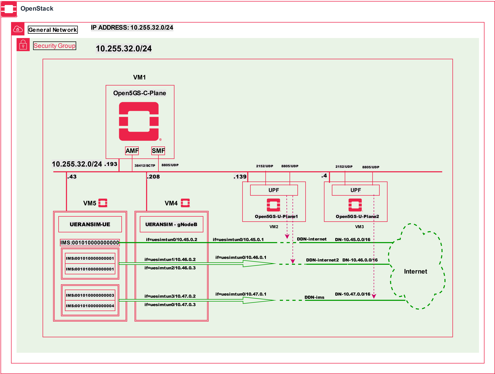

The 5GC / UE / RAN used are as follows.
- 5GC - Open5GS v2.5.6 (2023.01.12) - https://github.com/open5gs/open5gs
- UE / RAN - UERANSIM v3.2.6 - https://github.com/aligungr/UERANSIM

Each VMs are as follows.  
| VM # | SW & Role | IP address | OS | Memory (Min) | HDD (Min) |
| --- | --- | --- | --- | --- | --- |
| VM1 | Open5GS 5GC C-Plane | 10.255.32.215/24 | Ubuntu 22.04 | 4GB | 20GB |
| VM2 | Open5GS 5GC U-Plane1  | 10.255.32.218/24 | Ubuntu Cloud 22.04 | 4GB | 20GB |
| VM3 | Open5GS 5GC U-Plane2  | 10.255.32.219/24 | Ubuntu Cloud 22.04 | 4GB | 20GB |
| VM4 | UERANSIM RAN (gNodeB) | 10.255.32.174/24 | Ubuntu Cloud 22.04 | 2GB | 15GB |
| VM5 | UERANSIM UE | 10.255.32.195/24 | Ubuntu Cloud 22.04 | 2GB | 15GB |

Subscriber Information (other information is the same) is as follows.  
**Note. Please select OP or OPc according to the setting of UERANSIM UE configuration files.**
| UE # | IMSI | DNN | OP/OPc |
| --- | --- | --- | --- |
| UE0 | 001010000000000 | internet | OPc |
| UE1 | 001010000000001 | internet2 | OPc |
| UE2 | 001010000000002 | internet2 | OPc |
| UE3 | 001010000000003 | ims | OPc |
| UE4 | 001010000000004 | ims | OPc |

I registered these information with the Open5GS WebUI.
In addition, [3GPP TS 35.208](https://www.3gpp.org/DynaReport/35208.htm) "4.3 Test Sets" is published by 3GPP as test data for the 3GPP authentication and key generation functions (MILENAGE).

Each DNs are as follows.
| DN | TUNnel interface of DN | DNN | TUNnel interface of UE | U-Plane # |
| --- | --- | --- | --- | --- |
| 10.45.0.0/16 | ogstun | internet | uesimtun0 | U-Plane1 |
| 10.46.0.0/16 | ogstun2 | internet2 | uesimtun1, uesimtun2 | U-Plane1 |
| 10.47.0.0/16 | ogstun3 | ims | uesimtun3, uesimtun4 | U-Plane2 |


<a id="changes"></a>

## Changes in configuration files of Open5GS 5GC and UERANSIM UE / RAN

Please refer to the following for building Open5GS and UERANSIM respectively.
- Open5GS v2.5.6 (2023.01.12) - https://open5gs.org/open5gs/docs/guide/02-building-open5gs-from-sources/
- UERANSIM v3.2.6 - https://github.com/aligungr/UERANSIM/wiki/Installation
- OR you can install Open5GS directly using packages by clicking [here](https://open5gs.org/open5gs/docs/guide/01-quickstart/) to follow the instructions

<a id="changes_cp"></a>

### Changes in configuration files of Open5GS 5GC C-Plane

The following parameters including DNN can be used in the logic that selects UPF as the connection destination by PFCP.

- DNN
- TAC (Tracking Area Code)
- nr_CellID

For the sake of simplicity, I used only DNN this time. Please refer to [here](https://github.com/open5gs/open5gs/pull/560#issue-483001043) for the logic to select UPF.

- `open5gs/install/etc/open5gs/amf.yaml`
```diff
--- amf.yaml.orig       2023-01-12 20:33:18.555295469 +0900
+++ amf.yaml    2023-01-12 21:17:46.362251130 +0900
@@ -342,26 +342,26 @@
       - addr: 127.0.0.5
         port: 7777
     ngap:
-      - addr: 127.0.0.5
+      - addr: 10.255.32.215
     metrics:
       - addr: 127.0.0.5
         port: 9090
     guami:
       - plmn_id:
-          mcc: 999
-          mnc: 70
+          mcc: 001
+          mnc: 01
         amf_id:
           region: 2
           set: 1
     tai:
       - plmn_id:
-          mcc: 999
-          mnc: 70
+          mcc: 001
+          mnc: 01
         tac: 1
     plmn_support:
       - plmn_id:
-          mcc: 999
-          mnc: 70
+          mcc: 001
+          mnc: 01
         s_nssai:
           - sst: 1
     security:
```
- `open5gs/install/etc/open5gs/smf.yaml`
```diff
--- smf.yaml.orig       2023-01-12 20:33:18.526295426 +0900
+++ smf.yaml    2023-01-12 21:18:52.828987871 +0900
@@ -508,20 +508,21 @@
       - addr: 127.0.0.4
         port: 7777
     pfcp:
-      - addr: 127.0.0.4
-      - addr: ::1
+      - addr: 10.255.32.215
     gtpc:
       - addr: 127.0.0.4
-      - addr: ::1
     gtpu:
-      - addr: 127.0.0.4
-      - addr: ::1
+      - addr: 10.255.32.215
     metrics:
       - addr: 127.0.0.4
         port: 9090
     subnet:
       - addr: 10.45.0.1/16
-      - addr: 2001:db8:cafe::1/48
+        dnn: internet
+      - addr: 10.46.0.1/16
+        dnn: internet2
+      - addr: 10.47.0.1/16
+        dnn: ims
     dns:
       - 8.8.8.8
       - 8.8.4.4
@@ -695,7 +696,10 @@
 #
 upf:
     pfcp:
-      - addr: 127.0.0.7
+      - addr: 192.168.0.112
+        dnn: [internet, internet2]
+      - addr: 192.168.0.113
+        dnn: ims
 
 #
 # parameter:
```
**Important to read:** In our case we have used only DNN(internet, internet2 for c-plane)

<a id="changes_up1"></a>

### Changes in configuration files of Open5GS 5GC U-Plane1

- `open5gs/install/etc/open5gs/upf.yaml`
```diff
--- upf.yaml.orig       2023-01-12 20:44:33.674609278 +0900
+++ upf.yaml    2023-01-12 21:20:23.618010086 +0900
@@ -173,12 +173,16 @@
 #
 upf:
     pfcp:
-      - addr: 127.0.0.7
+      - addr: 192.168.0.218
     gtpu:
-      - addr: 127.0.0.7
+      - addr: 192.168.0.218
     subnet:
       - addr: 10.45.0.1/16
-      - addr: 2001:db8:cafe::1/48
+        dnn: internet
+        dev: ogstun
+      - addr: 10.46.0.1/16
+        dnn: internet2
+        dev: ogstun2
     metrics:
       - addr: 127.0.0.7
         port: 9090
```

<a id="changes_up2"></a>

### Changes in configuration files of Open5GS 5GC U-Plane2

- `open5gs/install/etc/open5gs/upf.yaml`
```diff
--- upf.yaml.orig       2023-01-12 20:53:25.948221315 +0900
+++ upf.yaml    2023-01-12 21:21:42.819471055 +0900
@@ -173,12 +173,13 @@
 #
 upf:
     pfcp:
-      - addr: 127.0.0.7
+      - addr: 10.255.32.219
     gtpu:
-      - addr: 127.0.0.7
+      - addr: 10.255.32.219
     subnet:
-      - addr: 10.45.0.1/16
-      - addr: 2001:db8:cafe::1/48
+      - addr: 10.47.0.1/16
+        dnn: ims
+        dev: ogstun3
     metrics:
       - addr: 127.0.0.7
         port: 9090
```
**Important to read:** In our case we have used only one UPF

<a id="changes_ueransim"></a>

### Changes in configuration files of UERANSIM UE / RAN

<a id="changes_ran"></a>

#### Changes in configuration files of RAN

- `UERANSIM/config/open5gs-gnb.yaml`
```diff
--- open5gs-gnb.yaml.orig       2022-07-03 13:06:43.000000000 +0900
+++ open5gs-gnb.yaml    2023-01-12 21:26:20.653023311 +0900
@@ -1,17 +1,17 @@
-mcc: '999'          # Mobile Country Code value
-mnc: '70'           # Mobile Network Code value (2 or 3 digits)
+mcc: '001'          # Mobile Country Code value
+mnc: '01'           # Mobile Network Code value (2 or 3 digits)
 
 nci: '0x000000010'  # NR Cell Identity (36-bit)
 idLength: 32        # NR gNB ID length in bits [22...32]
 tac: 1              # Tracking Area Code
 
-linkIp: 127.0.0.1   # gNB's local IP address for Radio Link Simulation (Usually same with local IP)
-ngapIp: 127.0.0.1   # gNB's local IP address for N2 Interface (Usually same with local IP)
-gtpIp: 127.0.0.1    # gNB's local IP address for N3 Interface (Usually same with local IP)
+linkIp: 10.255.32.174   # gNB's local IP address for Radio Link Simulation (Usually same with local IP)
+ngapIp: 10.255.32.174   # gNB's local IP address for N2 Interface (Usually same with local IP)
+gtpIp: 10.255.32.174    # gNB's local IP address for N3 Interface (Usually same with local IP)
 
 # List of AMF address information
 amfConfigs:
-  - address: 127.0.0.5
+  - address: 10.255.32.215
     port: 38412
 
 # List of supported S-NSSAIs by this gNB
```

<a id="changes_ue0"></a>

#### Changes in configuration files of UE0 (IMSI-001010000000000)

First, copy `open5gs-ue0.yaml` from `open5gs-ue.yaml`.
```
# cd UERANSIM/config
# cp open5gs-ue.yaml open5gs-ue0.yaml
```
Next, edit `open5gs-ue0.yaml`.
- `UERANSIM/config/open5gs-ue0.yaml`
```diff
--- open5gs-ue.yaml.orig        2022-07-03 13:06:43.000000000 +0900
+++ open5gs-ue0.yaml    2023-01-12 21:28:09.068725736 +0900
@@ -1,9 +1,9 @@
 # IMSI number of the UE. IMSI = [MCC|MNC|MSISDN] (In total 15 digits)
-supi: 'imsi-999700000000001'
+supi: 'imsi-001010000000000'
 # Mobile Country Code value of HPLMN
-mcc: '999'
+mcc: '001'
 # Mobile Network Code value of HPLMN (2 or 3 digits)
-mnc: '70'
+mnc: '01'
 
 # Permanent subscription key
 key: '465B5CE8B199B49FAA5F0A2EE238A6BC'
@@ -20,7 +20,7 @@
 
 # List of gNB IP addresses for Radio Link Simulation
 gnbSearchList:
-  - 127.0.0.1
+  - 10.255.32.174
 
 # UAC Access Identities Configuration
 uacAic:
```

<a id="changes_ue1"></a>

#### Changes in configuration files of UE1 (IMSI-001010000000001)

First, copy `open5gs-ue1.yaml` from `open5gs-ue.yaml`.
```
# cd UERANSIM/config
# cp open5gs-ue.yaml open5gs-ue1.yaml
```
Next, edit `open5gs-ue1.yaml`.
- `UERANSIM/config/open5gs-ue1.yaml`
```diff
--- open5gs-ue.yaml.orig        2022-07-03 13:06:43.000000000 +0900
+++ open5gs-ue1.yaml    2023-01-12 21:28:23.825908576 +0900
@@ -1,9 +1,9 @@
 # IMSI number of the UE. IMSI = [MCC|MNC|MSISDN] (In total 15 digits)
-supi: 'imsi-999700000000001'
+supi: 'imsi-001010000000001'
 # Mobile Country Code value of HPLMN
-mcc: '999'
+mcc: '001'
 # Mobile Network Code value of HPLMN (2 or 3 digits)
-mnc: '70'
+mnc: '01'
 
 # Permanent subscription key
 key: '465B5CE8B199B49FAA5F0A2EE238A6BC'
@@ -20,7 +20,7 @@
 
 # List of gNB IP addresses for Radio Link Simulation
 gnbSearchList:
-  - 127.0.0.1
+  - 10.255.32.174
 
 # UAC Access Identities Configuration
 uacAic:
@@ -39,7 +39,7 @@
 # Initial PDU sessions to be established
 sessions:
   - type: 'IPv4'
-    apn: 'internet'
+    apn: 'internet2'
     slice:
       sst: 1
 
```

<a id="changes_ue2"></a>

#### Changes in configuration files of UE2 (IMSI-001010000000002)

First, copy `open5gs-ue2.yaml` from `open5gs-ue.yaml`.
```
# cd UERANSIM/config
# cp open5gs-ue.yaml open5gs-ue2.yaml
```
Next, edit `open5gs-ue2.yaml`.
- `UERANSIM/config/open5gs-ue2.yaml`
```diff
--- open5gs-ue.yaml.orig        2022-07-03 13:06:43.000000000 +0900
+++ open5gs-ue2.yaml    2023-01-12 21:28:42.741142678 +0900
@@ -1,9 +1,9 @@
 # IMSI number of the UE. IMSI = [MCC|MNC|MSISDN] (In total 15 digits)
-supi: 'imsi-999700000000001'
+supi: 'imsi-001010000000002'
 # Mobile Country Code value of HPLMN
-mcc: '999'
+mcc: '001'
 # Mobile Network Code value of HPLMN (2 or 3 digits)
-mnc: '70'
+mnc: '01'
 
 # Permanent subscription key
 key: '465B5CE8B199B49FAA5F0A2EE238A6BC'
@@ -20,7 +20,7 @@
 
 # List of gNB IP addresses for Radio Link Simulation
 gnbSearchList:
-  - 127.0.0.1
+  - 10.255.32.174
 
 # UAC Access Identities Configuration
 uacAic:
@@ -39,7 +39,7 @@
 # Initial PDU sessions to be established
 sessions:
   - type: 'IPv4'
-    apn: 'internet'
+    apn: 'internet2'
     slice:
       sst: 1
 
```

<a id="changes_ue3"></a>

#### Changes in configuration files of UE3 (IMSI-001010000000003)

First, copy `open5gs-ue3.yaml` from `open5gs-ue.yaml`.
```
# cd UERANSIM/config
# cp open5gs-ue.yaml open5gs-ue3.yaml
```
Next, edit `open5gs-ue3.yaml`.
- `UERANSIM/config/open5gs-ue3.yaml`
```diff
--- open5gs-ue.yaml.orig        2022-07-03 13:06:43.000000000 +0900
+++ open5gs-ue3.yaml    2023-01-12 21:28:54.692290443 +0900
@@ -1,9 +1,9 @@
 # IMSI number of the UE. IMSI = [MCC|MNC|MSISDN] (In total 15 digits)
-supi: 'imsi-999700000000001'
+supi: 'imsi-001010000000003'
 # Mobile Country Code value of HPLMN
-mcc: '999'
+mcc: '001'
 # Mobile Network Code value of HPLMN (2 or 3 digits)
-mnc: '70'
+mnc: '01'
 
 # Permanent subscription key
 key: '465B5CE8B199B49FAA5F0A2EE238A6BC'
@@ -20,7 +20,7 @@
 
 # List of gNB IP addresses for Radio Link Simulation
 gnbSearchList:
-  - 127.0.0.1
+  - 10.255.32.174
 
 # UAC Access Identities Configuration
 uacAic:
@@ -39,7 +39,7 @@
 # Initial PDU sessions to be established
 sessions:
   - type: 'IPv4'
-    apn: 'internet'
+    apn: 'ims'
     slice:
       sst: 1
 
```

<a id="changes_ue4"></a>

#### Changes in configuration files of UE4 (IMSI-001010000000004)

First, copy `open5gs-ue4.yaml` from `open5gs-ue.yaml`.
```
# cd UERANSIM/config
# cp open5gs-ue.yaml open5gs-ue4.yaml
```
Next, edit `open5gs-ue4.yaml`.
- `UERANSIM/config/open5gs-ue4.yaml`
```diff
--- open5gs-ue.yaml.orig        2022-07-03 13:06:43.000000000 +0900
+++ open5gs-ue4.yaml    2023-01-12 21:29:02.396385648 +0900
@@ -1,9 +1,9 @@
 # IMSI number of the UE. IMSI = [MCC|MNC|MSISDN] (In total 15 digits)
-supi: 'imsi-999700000000001'
+supi: 'imsi-001010000000004'
 # Mobile Country Code value of HPLMN
-mcc: '999'
+mcc: '001'
 # Mobile Network Code value of HPLMN (2 or 3 digits)
-mnc: '70'
+mnc: '01'
 
 # Permanent subscription key
 key: '465B5CE8B199B49FAA5F0A2EE238A6BC'
@@ -20,7 +20,7 @@
 
 # List of gNB IP addresses for Radio Link Simulation
 gnbSearchList:
-  - 127.0.0.1
+  - 10.255.32.174
 
 # UAC Access Identities Configuration
 uacAic:
@@ -39,7 +39,7 @@
 # Initial PDU sessions to be established
 sessions:
   - type: 'IPv4'
-    apn: 'internet'
+    apn: 'ims'
     slice:
       sst: 1
 
```

<a id="network_settings"></a>

## Network settings of Open5GS 5GC and UERANSIM UE / RAN

<a id="network_settings_up1"></a>

### Network settings of Open5GS 5GC U-Plane1

First, uncomment the next line in the `/etc/sysctl.conf` file and reflect it in the OS.
```
net.ipv4.ip_forward=1
```
```
sudo sysctl -p
```
Next, configure the TUNnel interface and NAPT.
```
sudo ip tuntap add name ogstun mode tun
sudo ip addr add 10.45.0.1/16 dev ogstun
sudo ip link set ogstun up

sudo iptables -t nat -A POSTROUTING -s 10.45.0.0/16 ! -o ogstun -j MASQUERADE

sudo ip tuntap add name ogstun2 mode tun
sudo ip addr add 10.46.0.1/16 dev ogstun2
sudo ip link set ogstun2 up

sudo iptables -t nat -A POSTROUTING -s 10.46.0.0/16 ! -o ogstun2 -j MASQUERADE
```

<a id="network_settings_up2"></a>

### Network settings of Open5GS 5GC U-Plane2

First, uncomment the next line in the `/etc/sysctl.conf` file and reflect it in the OS.
```
net.ipv4.ip_forward=1
```
```
sudo sysctl -p
```
Next, configure the TUNnel interface and NAPT.
```
sudo ip tuntap add name ogstun3 mode tun
sudo ip addr add 10.47.0.1/16 dev ogstun3
sudo ip link set ogstun3 up

sudo iptables -t nat -A POSTROUTING -s 10.47.0.0/16 ! -o ogstun3 -j MASQUERADE
```

<a id="build"></a>

## Build Open5GS and UERANSIM

Please refer to the following for building Open5GS and UERANSIM respectively.
- Open5GS v2.5.6 (2023.01.12) - https://open5gs.org/open5gs/docs/guide/02-building-open5gs-from-sources/
- UERANSIM v3.2.6 - https://github.com/aligungr/UERANSIM/wiki/Installation

Install MongoDB on Open5GS 5GC C-Plane machine.
It is not necessary to install MongoDB on Open5GS 5GC U-Plane machines.
[MongoDB Compass](https://www.mongodb.com/products/compass) is a convenient tool to look at the MongoDB database.

## Access OpenGS WEBUI
 - URL: http://[your ip address]:3000
 - Username: admin
 - Password: 1423 <br>
 
 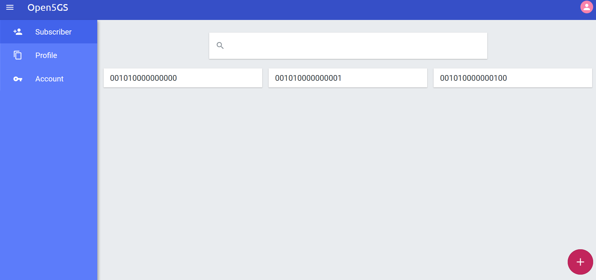

<a id="run"></a>

## Run Open5GS 5GC and UERANSIM UE / RAN

First run the 5GC, then UERANSIM (UE & RAN implementation).

<a id="run_cp"></a>

### Verify Open5GS 5GC Logs

- SMF logs
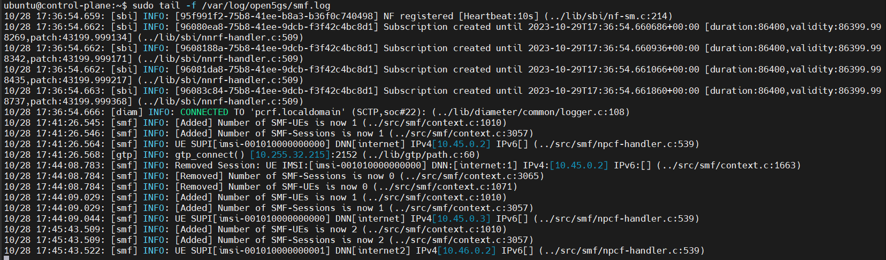
- AMF logs
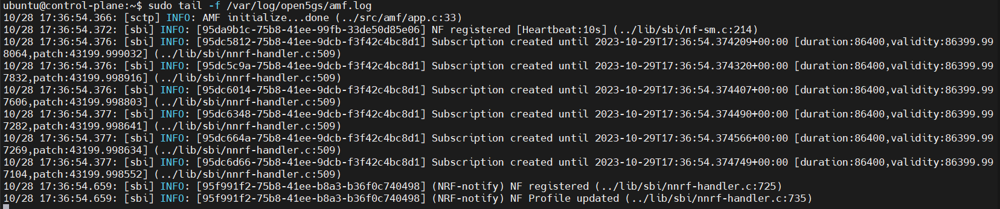
- UPF logs
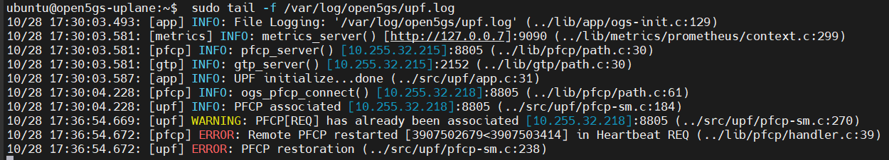
Retry again after fixing bugs
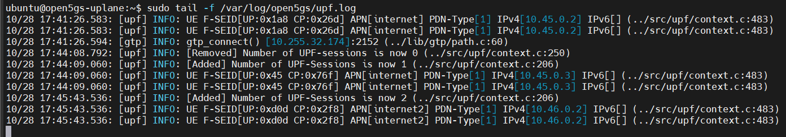


<a id="run_ueran"></a>

### Run UERANSIM

Here, the case of UE0 (IMSI-001010000000000) & RAN is described.
First, do an NG Setup between gNodeB and 5GC, then register the UE with 5GC and establish a PDU session.

Please refer to the following for usage of UERANSIM.

https://github.com/aligungr/UERANSIM/wiki/Usage

<a id="start_gnb"></a>

#### Start gNB

Start gNB as follows. Make sure you are in **build** folder
```
./nr-gnb -c ../config/open5gs-gnb.yaml
```
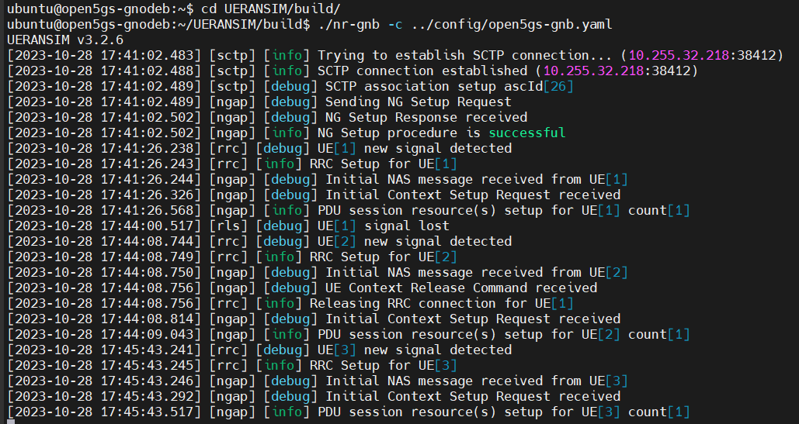

<a id="start_ue"></a>

#### Start UE (UE0)

Start UE (UE0) as follows. This will register the UE with 5GC and establish a PDU session. Make sure you are in **build** folder
```
./nr-ue -c ../config/open5gs-ue0.yaml 
```
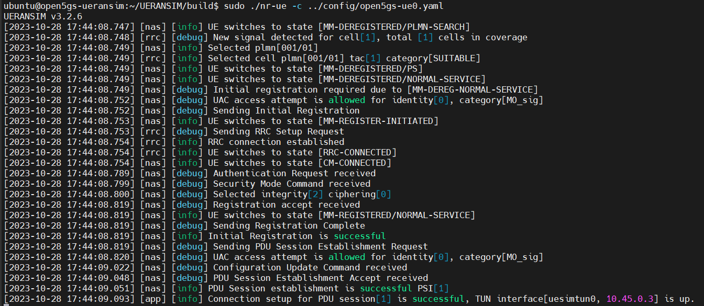Show ueransim interfaces
```
ip address
```
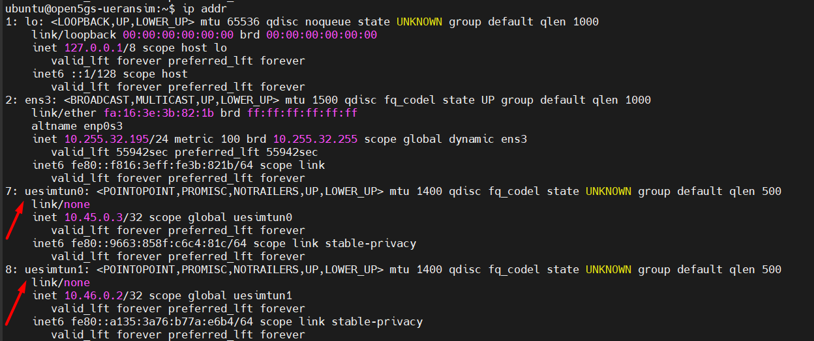


<a id="ping"></a>

## Ping google.com

Specify the UE0's TUNnel interface and try ping.

Please refer to the following for usage of TUNnel interface.

https://github.com/aligungr/UERANSIM/wiki/Usage

<a id="ping_1"></a>

### Case for going through DN 10.45.0.0/16

Execute `tcpdump` on VM2 (U-Plane1) and check that the packet goes through `if=ogstun`.
- `ping google.com` on VM5 (UE0)
```
ping google.com -I uesimtun0 -n
```
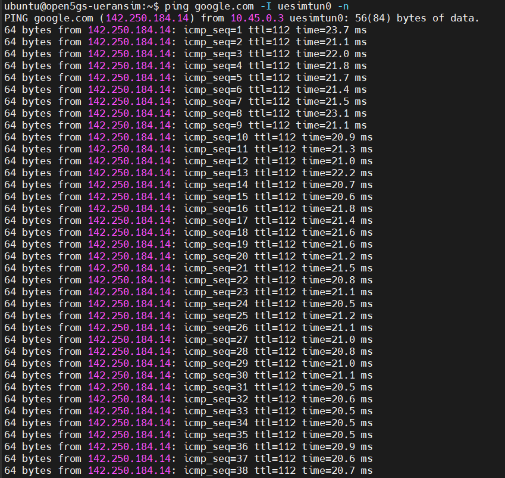
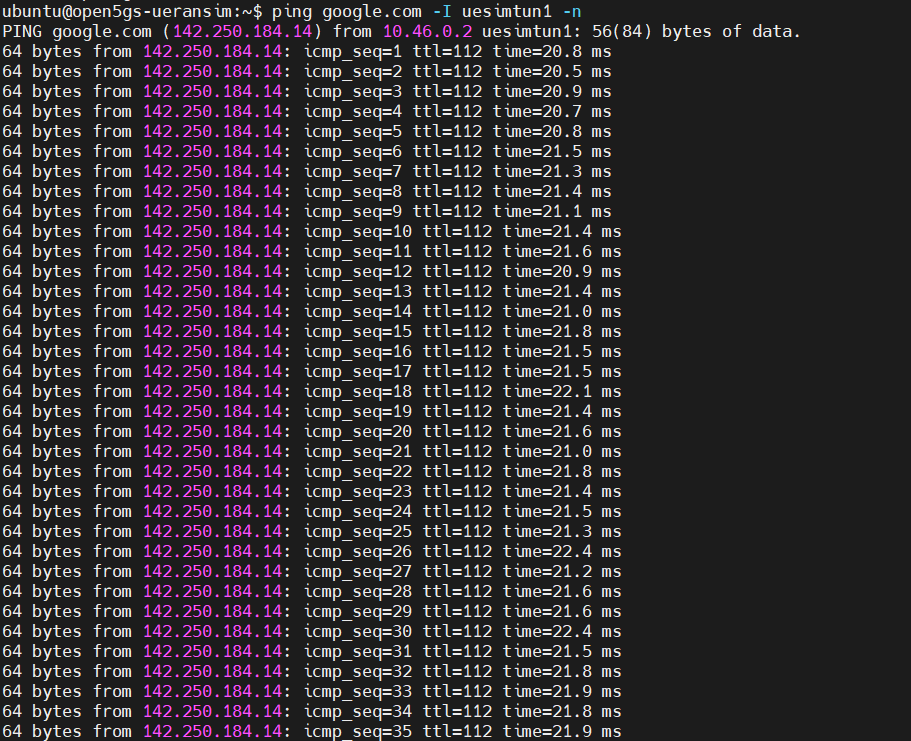
- Run `tcpdump` on VM2 (U-Plane1)
```
tcpdump -i ogstun -n
```
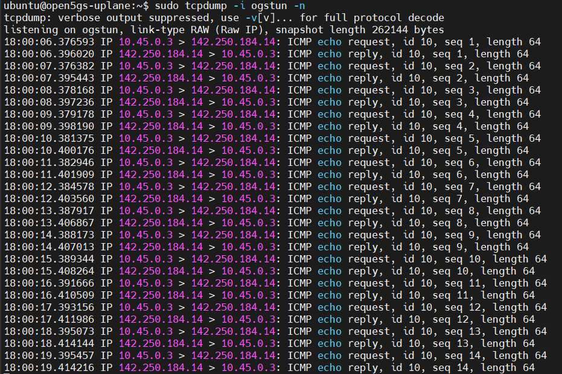
```
tcpdump -i ogstun2 -n
```
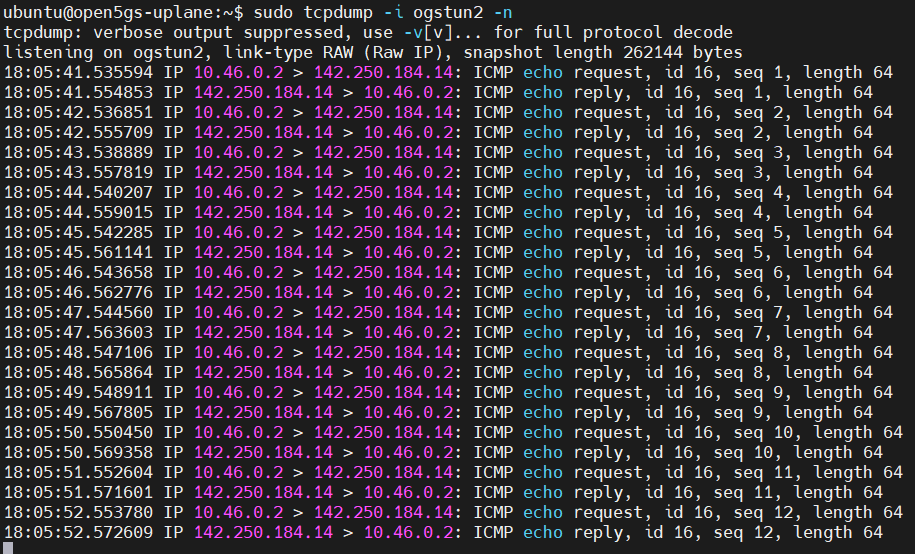


You could specify the IP address assigned to the TUNnel interface to run almost any applications as in the following example using `nr-binder` tool.

- `curl google.com` on VM5 (UE0)
```
sh nr-binder 10.45.0.2 curl google.com
```
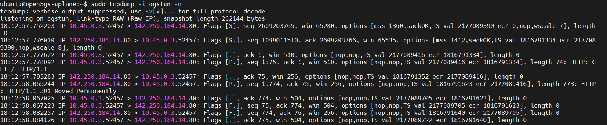

Please note that the `ping` tool does not work with `nr-binder`. Please refer to [here](https://github.com/aligungr/UERANSIM/issues/186#issuecomment-729534464) for the reason.

For `UE1`-`UE4` as well, execute `tcpdump` on each U-Plane and check the packets flowing through `ogstunX`.

You could now create the end-to-end TUN interfaces on the DN and send any packets on the network.

---
In investigating 5G SA, I have built a simulation environment and can now use a very useful system for investigating 5GC and MEC of 5G SA mobile network. I would like to thank the excellent developers and all the contributors of Open5GS and UERANSIM.

<a id="references"></a>

## References
[Open5GS Documentation Blog](https://open5gs.org/open5gs/) <br>
[Open5GS QUICK Start Documentation](https://open5gs.org/open5gs/docs/guide/01-quickstart/) <br>
[K8S Open5GS Related Installation](https://github.com/s5uishida/open5gs_5gc_ueransim_sample_config)